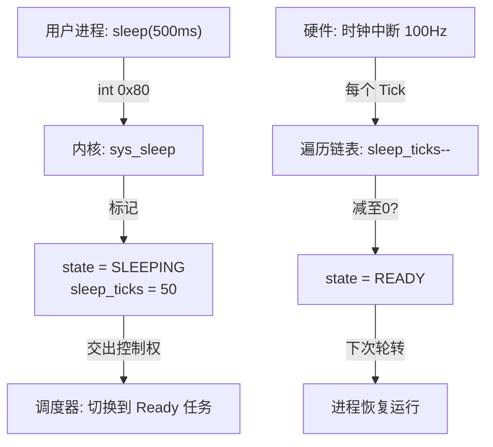

# 内核功能设计：实现 sys_sleep(ms) 休眠机制

## 1. 背景与目标
在实现 `sys_yield` 后，进程可以主动让出 CPU。但如果进程需要等待一段时间（如 100ms），目前只能在用户态不断 `yield`，这依然会产生无效的切换开销。

目标：实现 `sys_sleep(ms)`，使进程进入**“睡眠态”**。在休眠期间，调度器完全忽略该进程，不分配任何 CPU 时间，直到时间耗尽被唤醒。

## 2. 技术设计

### A. 进程控制块 (PCB) 扩展
需要在 `process_t` 结构体中增加状态管理字段：
- **`state`**：
  - `STATE_READY` (0): 进程已就绪，可以被调度。
  - `STATE_SLEEPING` (1): 进程正在休眠，调度器应跳过它。
- **`sleep_ticks`**：记录剩余的休眠滴答数（Ticks）。

### B. 系统调用接口 (API)
- **调用号**：`3` (SYSCALL_SLEEP)
- **参数**：EBX = 毫秒数 (ms)
- **处理逻辑**：
  1. 计算 `ticks = ms / (1000 / HZ)` (假设 HZ=100，则 10ms 为 1 tick)。
  2. 设置当前进程 `state = STATE_SLEEPING`。
  3. 设置当前进程 `sleep_ticks = ticks`。
  4. 立即调用 `schedule()` 切换到下一个任务。

### C. 唤醒机制 (Wake-up)
在**时钟中断 (PIT, IRQ 0)** 的处理器中增加逻辑：
1. 遍历全局进程链表 `process_list`。
2. 对于每个 `state == STATE_SLEEPING` 的进程：
   - `sleep_ticks--`。
   - 如果 `sleep_ticks` 减至 0，则将 `state` 修改回 `STATE_READY`。

### D. 调度算法升级
修改 `schedule()` 函数：
- **逻辑**：从 `current_process->next` 开始查找，跳过所有 `state == STATE_SLEEPING` 的进程。
- **保底机制**：必须确保 `Kernel_Idle` (PID 0) 永远处于 `STATE_READY`，且不参与休眠。如果所有用户进程都在睡觉，CPU 将停留在 Idle 进程执行 `hlt` 节能。

## 3. 核心流程示意 (Mermaid)

## 4. 实施路线图

1. **修改 `process.h`**：增加 `state` 和 `sleep_ticks` 字段，定义状态宏。
2. **修改 `process.c`**：
   - 初始化 `process_init` 中设置 PID 0 始终 READY。
   - 升级 `schedule()` 支撑状态过滤。
3. **修改 `interrupts.c`**：在时钟中断处理函数中增加“睡眠计数递减”逻辑。
4. **修改 `syscall.c`**：实现 3 号调用分发。
5. **修改 `kernel.c`**：在 `user_task` 中测试 `sys_sleep(500)`。

---
*设计者：Antigravity*
*日期：2026-01-05*
