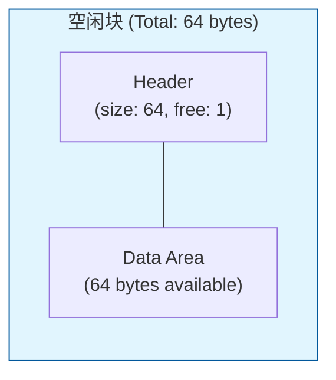
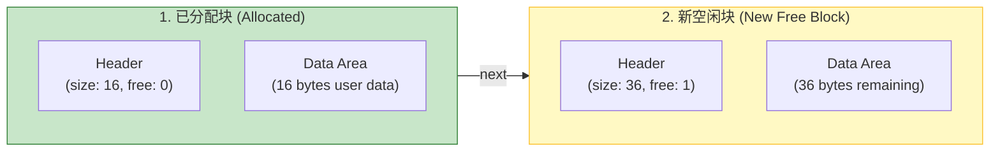
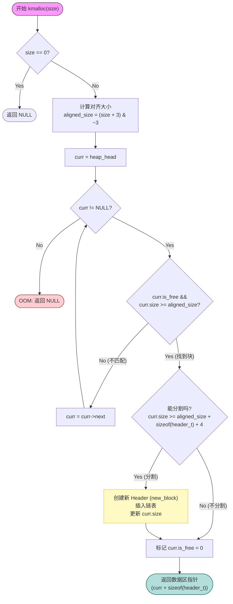

# 内核堆内存分配 (kmalloc) 详解

本文档详细解释了 `heap.c` 中 `kmalloc` 函数的实现原理、算法逻辑及内存结构变化。

## 1. 核心算法：First Fit (首次适应)

`kmalloc` 采用 **First Fit** 策略来寻找空闲内存块。
- **原理**：从链表头开始遍历，找到**第一个**满足大小要求的空闲块就立即停止搜索并进行分配。
- **优点**：分配速度快，逻辑简单。
- **缺点**：长期运行可能会导致链表前面的部分出现很多小碎片。

## 2. 内存对齐 (Alignment)

在分配前，请求的大小会被强制对齐到 4 字节边界。
```c
// (size + 3) & ~3 等价于 ceil(size / 4) * 4
size_t aligned_size = (size + 3) & ~3;
```
这是为了确保 CPU 访问内存的效率，以及满足某些硬件对地址对齐的要求。

## 3. 内存块分割 (Splitting)

当找到一个足够大的空闲块时，如果它比请求的大小大很多，直接分配会造成浪费。因此我们执行 **分割 (Splitting)** 操作。

### 分割条件
```c
// 剩余空间 = 当前块总大小 - 请求大小 - Header大小
// 必须保证剩余空间至少能容纳一个 Header 和最小的数据单元(4字节)
if (curr->size >= aligned_size + sizeof(header_t) + 4)
```

### 分割前后的内存视图

假设我们有一个 64 字节的空闲块，请求分配 16 字节。

#### 分割前 (Before Splitting)
一个大的空闲块。



#### 分割后 (After Splitting)
原块被切成两部分：**已分配块** 和 **新的空闲块**。


*(注：Header 大小假设为 12 字节，剩余计算：64 - 16 - 12 = 36)*

## 4. 执行流程图

以下是 `kmalloc` 函数的完整执行逻辑：



## 5. 关键代码对照

| 步骤 | 代码位置 | 说明 |
| :--- | :--- | :--- |
| **对齐** | `size_t aligned_size = (size + 3) & ~3;` | 向上取整到 4 的倍数 |
| **查找** | `while (curr != NULL) { ... }` | 遍历堆链表 |
| **检查** | `if (curr->is_free && curr->size >= aligned_size)` | First Fit 匹配逻辑 |
| **分割** | `if (curr->size >= aligned_size + sizeof(header_t) + 4)` | 判断是否有足够剩余空间建立新块 |
| **返回** | `return (void*)((uint32_t)curr + sizeof(header_t));` | 返回跳过 Header 后的地址给用户 |
