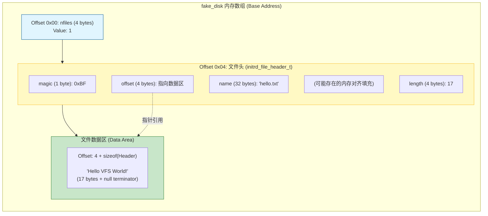

# InitRD 伪造磁盘构建过程图解

该文档详细解释了 `initrd.c` 中 `initrd_build_fake_disk` 函数的执行过程及其对内存布局的影响。

## 1. 函数功能概述

`initrd_build_fake_disk` 的作用是在内存数组 `fake_disk` 中手动构建一个简单的文件系统镜像。这个镜像包含：
1.  **超级块 (Superblock)**：这里简化为仅包含一个“文件数量”字段。
2.  **文件头 (File Headers)**：描述每个文件的元数据（文件名、位置、大小）。
3.  **文件内容 (File Content)**：实际的文件数据。

## 2. 执行步骤图解

### 步骤 1: 初始化文件数量

```c
uint32_t* nfiles_ptr = (uint32_t*)fake_disk;
*nfiles_ptr = 1;
```

此时 `fake_disk` 的前 4 个字节被设置为 1。

### 步骤 2: 写入文件头 (Header)

```c
initrd_file_header_t* file1 = (initrd_file_header_t*)(fake_disk + 4);
file1->magic = 0xBF;
// ... 复制文件名 "hello.txt" ...
file1->length = 17;
file1->offset = 4 + sizeof(initrd_file_header_t); 
```

我们在偏移量 4（跳过前面的 `nfiles`）处构建文件头结构体。关键是计算 `offset`，它指向紧随其后的数据区。

### 步骤 3: 写入文件内容

```c
char* content = "Hello VFS World!";
uint8_t* data = fake_disk + file1->offset;
// ... 复制内容 ...
```

将字符串数据写入到 `offset` 指向的内存位置。

## 3. 最终内存布局示意图

下图展示了 `fake_disk` 数组在函数执行完毕后的逻辑视图。



## 4. 关键数据结构参考

```c
typedef struct {
    uint8_t magic;    /* 魔数，用于校验 */
    char name[32];    /* 文件名 */
    uint32_t offset;  /* 数据相对于 fake_disk 起始位置的偏移量 */
    uint32_t length;  /* 文件数据长度 */
} initrd_file_header_t;
```

通过这种方式，`initrd_init` 后续可以通过读取 `fake_disk` 的前 4 个字节知道有多少个文件，然后遍历 Header 数组来挂载 VFS 节点。
