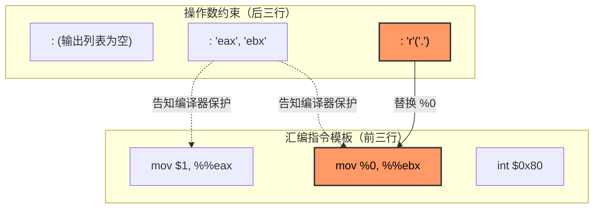

# GCC 内联汇编 `int 0x80` 代码详解

本文档详细解释了 `kernel.c` 中用于触发系统调用的内联汇编代码片段。该代码实现了从用户态（Ring 3）向内核态（Ring 0）的陷入操作。

## 1. 代码片段

```c
asm volatile (
    "mov $1, %%eax\n"
    "mov %0, %%ebx\n"
    "int $0x80\n"
    : : "r"(".") : "eax", "ebx"
);
```

## 2. 逐行解释

### 2.1 汇编指令模板（Template）

这部分是实际执行的汇编指令。

- **`asm volatile (`**
  - `asm`: GCC 扩展关键字，表示嵌入汇编。
  - `volatile`: 告诉编译器**禁止优化**（不要删除、不要重排），必须按原样执行。

- **`"mov $1, %%eax\n"`**
  - 将立即数 `1` 写入寄存器 `EAX`。
  - **含义**：设置系统调用号（Syscall Number）。在本内核中，`1` 代表“打印字符串”服务。
  - 注意：在内联汇编中，寄存器名需要用两个百分号 `%%` 转义（如 `%%eax`）。

- **`"mov %0, %%ebx\n"`**
  - 将占位符 `%0` 对应的值写入寄存器 `EBX`。
  - **含义**：设置系统调用的第一个参数。在这里，它是字符串 `.` 的内存地址。
  - `%0` 是一个**占位符**，会被编译器替换为具体的寄存器名。

- **`"int $0x80\n"`**
  - 执行软中断 `0x80`。
  - **含义**：触发中断，CPU 保存现场并跳转到 IDT 中索引 `0x80` 指向的中断处理函数（即系统调用分发器）。此时 CPU 特权级从 Ring 3 切换到 Ring 0。

### 2.2 操作数约束（Operands）

这部分定义了 C 语言变量与汇编指令之间的接口。

- **`: （输出部分）`**
  - 这里为空，表示这段汇编没有向 C 代码返回任何结果。

- **`: "r"(".") （输入部分）`**
  - **`"r"`**: 约束条件，表示“将输入值放入任意一个通用寄存器中”。
  - **`(".")`**: C 语言表达式，这里是一个字符串常量（实际上是该字符串的地址）。
  - **对应关系**：这是列表中的第 0 个操作数，所以它对应汇编模板中的 `%0`。编译器会生成代码，先把 `.` 的地址加载到某个寄存器（例如 `ECX`），然后将汇编中的 `%0` 替换为 `ECX`。

- **`: "eax", "ebx" （破坏部分/Clobber List）`**
  - 告诉编译器：这段汇编代码手动修改了 `EAX` 和 `EBX` 寄存器的值。
  - **作用**：编译器在生成这段代码前后的指令时，不会假设这两个寄存器还保存着旧值，从而避免逻辑错误。

## 3. 模板与约束的关系图解

前三行（模板）是“填空题”，后三行（约束）是“答案库”。



- **`%0` 是消费者**：在 `mov %0, %%ebx` 中等待被替换。
- **`"r"(".")` 是生产者**：作为输入列表的第 0 项，它提供了具体的值（字符串地址），并由编译器分配寄存器传递给 `%0`。

---
*文档生成时间：2026-01-19*
