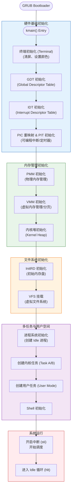

# 内核初始化流程 (Kernel Entry)

本文档描述了 MyOS 内核从 GRUB 引导后，进入 `kmain` 函数的初始化流程。

## 1. 核心初始化流程图

`kmain` 是 C 语言层面的入口点，负责按顺序初始化各个硬件抽象层 (HAL) 和内核子系统。

## 2. 关键阶段说明

### 2.1 硬件基础 (Hardware Base)
- **GDT**: 定义内核态和用户态的代码段/数据段，是进入保护模式和用户模式的基础。
- **IDT/PIC**: 设置中断处理函数（ISR），允许 CPU 响应键盘、时钟和系统调用（`int 0x80`）。

### 2.2 内存管理 (Memory Management)
- **PMM**: 管理物理页框（Page Frames），通常使用位图（Bitmap）或栈。
- **VMM**: 启用分页机制，映射虚拟地址到物理地址，实现内存隔离。
- **Heap**: 在 VMM 之上提供 `kmalloc`/`kfree`，用于动态分配内核结构体。

### 2.3 多任务 (Multitasking)
- **Process Init**: 将当前的执行流转换为第一个进程（通常是 PID 0 的 Idle 进程）。
- **Context Switch**: 依赖定时器中断（PIT）触发调度器，保存当前寄存器状态并加载下一个进程的状态。

### 2.4 用户模式 (User Mode)
- `user_task` 展示了如何从 Ring 0（内核）切换到 Ring 3（用户）。
- 通过 `int 0x80` 软中断发起系统调用，重新陷入内核执行特权操作（如打印字符）。
