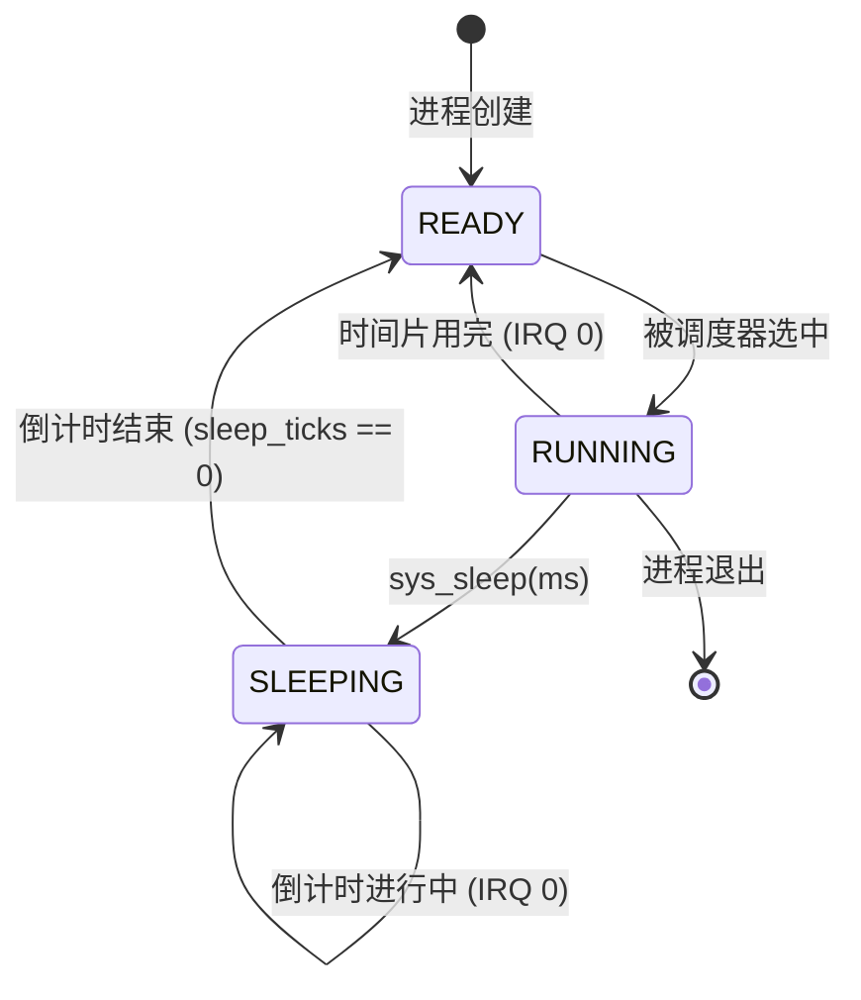

# 技术实现：sys_sleep(ms) 非阻塞休眠机制

本文档详细记录了内核中 `sys_sleep` 系统调用的实现细节。这种机制通过引入“进程状态”的概念，实现了真正意义上的非阻塞休眠，极大地提高了 CPU 的利用率。

## 1. 核心状态转换图 (Mermaid)



## 2. 核心代码变更 (Diff)

### A. 进程控制块 (PCB) 扩展
在 `process.h` 中引入状态管理字段。

```diff
[file: process.h]
+#define STATE_READY    0
+#define STATE_SLEEPING 1
+
 typedef struct process {
     uint32_t pid;
-    uint32_t esp;
-    uint32_t kernel_stack_top;
+    uint32_t esp;              
+    uint32_t kernel_stack_top; 
+    uint32_t state;            /* 新增：就绪/休眠状态 */
+    uint32_t sleep_ticks;      /* 新增：剩余时钟嘀嗒 */
     char name[32];
     struct process* next;
 } process_t;
```

### B. 智能调度逻辑
调度器现在会“跳过”所有非就绪的进程。

```diff
[file: process.c]
 struct registers* schedule(struct registers* current_regs) {
     current_process->esp = (uint32_t)current_regs;
     
-    current_process = current_process->next;
+    /* 循环查找下一个就绪进程 */
+    process_t* next = current_process->next;
+    while (next->state != STATE_READY) {
+        next = next->next;
+        /* PID 0 永远就绪，保证不陷入死循环 */
+    }
+    current_process = next;
     
     tss_set_stack(current_process->kernel_stack_top);
     return (struct registers*)current_process->esp;
 }
```

### C. 自动唤醒机制 (IRQ 0)
在时钟中断中，每 10ms (100Hz) 巡检并递减休眠计时。

```diff
[file: interrupts.c]
+/* 更新进程休眠状态 */
+process_update_sleep_ticks();
+
 /* 调用调度器 */
 return schedule(regs);
```

```diff
[file: process.c]
+void process_update_sleep_ticks(void) {
+    process_t* curr = process_list;
+    do {
+        if (curr->state == STATE_SLEEPING) {
+            if (curr->sleep_ticks > 0) curr->sleep_ticks--;
+            if (curr->sleep_ticks == 0) curr->state = STATE_READY;
+        }
+        curr = curr->next;
+    } while (curr != process_list);
+}
```

### D. 系统调用分发
由软件触发的状态切换。

```diff
[file: syscall.c]
+    } else if (regs->eax == 3) { // sleep
+        uint32_t ticks = regs->ebx / 10; // ms -> ticks
+        process_sleep(ticks ? ticks : 1);
+        return schedule(regs); // 立即交还控制权
+    }
```

## 3. 实现原理解析

### 为什么要区分 Ready 和 Sleeping？
在之前的 `sys_yield` 模型中，如果要等待 500ms，进程只能不断地“ Yield -> 被调度 -> 发现没到时间 -> 再次 Yield”。这会产生大量无意义的上下文切换开销。
现在的 `sys_sleep` 模型中：
1. **彻底解脱**：进程一旦休眠，会被调度器直接“无视”。
2. **零开销等待**：在休眠期间，该进程完全不占用 CPU 的任何执行时间。
3. **精准唤醒**：由内核的时钟中断（系统的“心跳”）负责在毫秒级别进行计时并精准唤醒。

## 4. 结论
`sys_sleep` 的实现标志着内核已经具备了基本的**进程生命周期管理**能力。这是迈向复杂并发控制（如信号量、互斥锁）的基础，因为它验证了内核能够通过状态位来控制谁能跑、谁该等。

---
*记录人：Antigravity*
*时间：2026-01-05*
