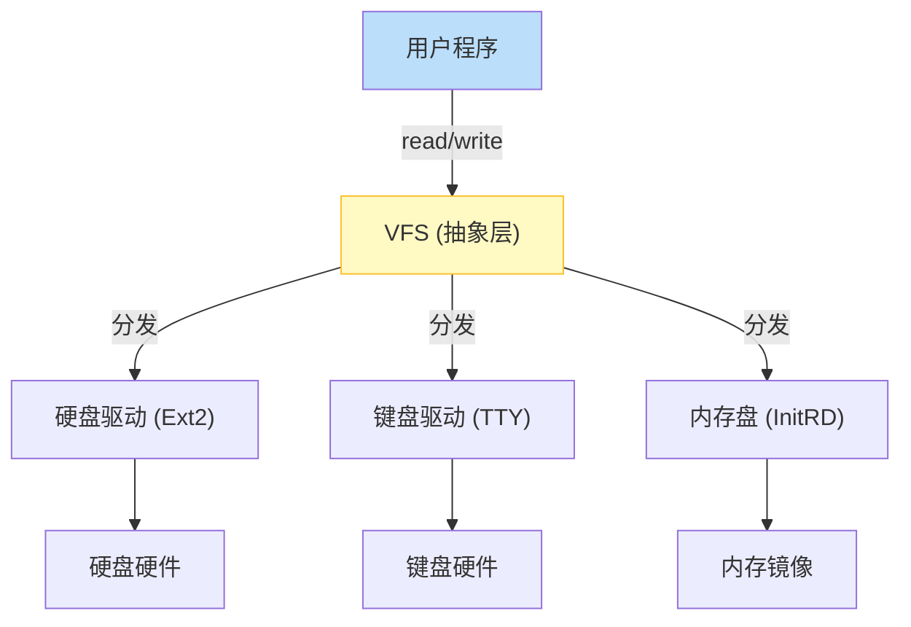
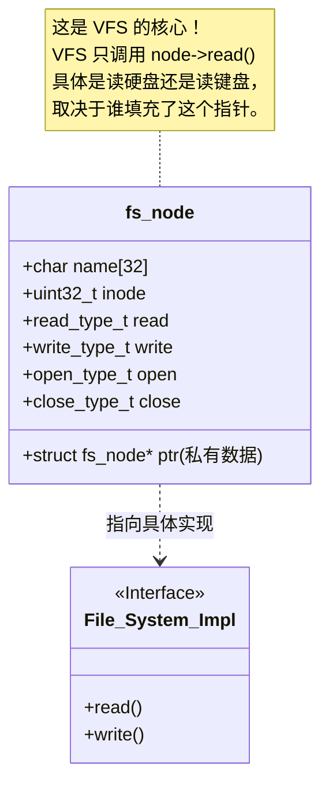
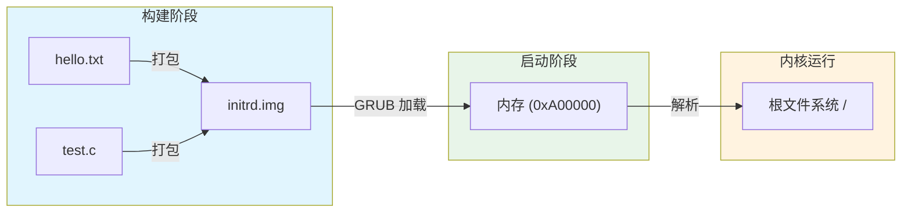

# 第10周：虚拟文件系统 (VFS) 理论

> **目标**：给所有数据穿上统一的“外衣”。无论是硬盘上的文件、键盘输入、还是内存中的数据，在操作系统眼里，它们都是 **文件**。

## 1. 为什么需要 VFS (Virtual File System)?

操作系统的世界里有千奇百怪的设备：硬盘 (SATA/NVMe)、光盘 (ISO9660)、网络 (NFS)、甚至终端屏幕。
如果应用程序需要分别针对每种设备写代码（例如 `read_harddisk()`, `read_keyboard()`），那就乱套了。

**VFS** 是内核中的一个**抽象层**，它规定了一套标准接口（API）：`read`, `write`, `open`, `close`。
所有设备驱动必须适配这套接口。这就是 Unix 哲学：**一切皆文件 (Everything is a file)**。

## 2. 核心数据结构：fs_node (文件节点)

在面向对象的语言（如 C++，Java）中，我们可以用 `Interface` 来实现多态。在 C 语言内核中，我们用 **函数指针结构体** 来实现。

我们定义一个通用的文件节点 `fs_node`，它不关心背后的实现，只包含操作函数指针。

## 3. 什么是 InitRD (Initial Ramdisk)?

实现真正的硬盘驱动（如 IDE/AHCI）和文件系统（如 FAT32/Ext2）非常复杂。
为了尽快拥有文件系统，我们走一个捷径：**InitRD**。

*   **原理**：在构建操作系统镜像时，把一堆文件（hello.txt, test.bin）打包成一个简单的二进制包。
*   **加载**：GRUB 引导加载器把这个包和内核一起加载到内存中。
*   **使用**：内核启动后，直接把这段内存区域当作一个“只读硬盘”来解析。

它不需要读写 IO 端口，纯粹是内存操作，速度极快，非常适合作为我们的第一个文件系统。

---

### 下一阶段任务
我们将定义 `fs.h` 中的 `fs_node` 结构体，并实现一个极其简单的 `InitRD` 驱动，让你能通过 `vfs_read` 读取打包进去的文件内容。
