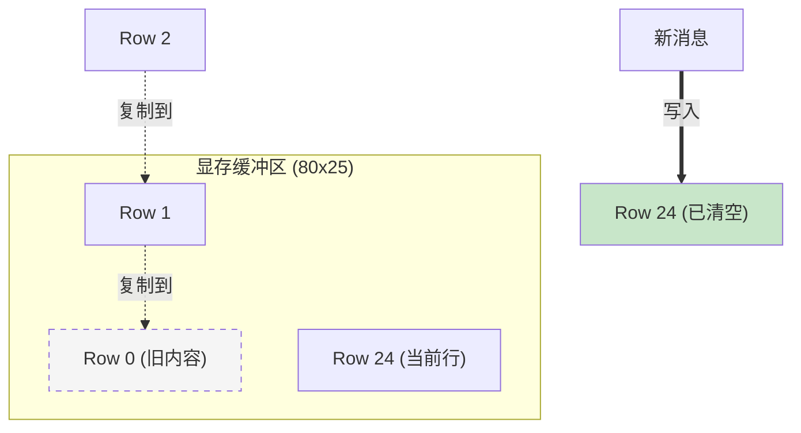

# Week 10 扩展学习：增强型虚拟终端 (滚屏实现)

> **摘要**：在开发过程中，随着内核日志输出越来越多，固定的 80x25 屏幕不再够用。本文记录了如何通过“内存搬运”实现终端的自动滚屏功能。

## 1. 问题背景

默认的 VGA 文本模式缓冲区起始地址为 `0xB8000`，大小固定为 80列 × 25行。
如果代码只是简单地在行末换行，当到达第 25 行后，通常会有两种处理方式：
1. **回绕 (Wrap)**：光标回到第 0 行，覆盖最旧的内容（目前的实现，像环形缓冲区）。
2. **滚屏 (Scroll)**：将所有内容向上推一行，腾出最后一行给新内容（即本改进方案）。

## 2. 核心原理：平移与清空

实现滚屏只需要简单的两步走：

1. **行平移 (Row Shifting)**：将第 1-24 行的内容，依次拷贝到第 0-23 行的位置。
2. **末行清空 (Blanking)**：此时第 24 行（最后一行）内容虽然还在，但已经是重复的了，需要用空格和默认背景色充满。



## 3. 代码实现 (Diff)

改动点位于 `terminal.c` 的私有函数 `terminal_newline` 中。

```diff
 // 处理换行：
-// - 列归零，行+1；到达底部后从顶部重新开始（简单环形，不滚屏）
-// - 如需滚屏，可改为上移一行并清空最后一行
+// - 列归零，行+1
+// - 如果到达底部，整体上移一行（滚屏）
 static void terminal_newline(void) {
     terminal.column = 0;
     if (++terminal.row == VGA_HEIGHT) {
-        terminal.row = 0;
+        /* 1. 滚屏逻辑：将后 24 行内容(1-24) 复制到 前 24 行(0-23) */
+        for (size_t y = 1; y < VGA_HEIGHT; y++) {
+            for (size_t x = 0; x < VGA_WIDTH; x++) {
+                const size_t src_index = y * VGA_WIDTH + x;
+                const size_t dst_index = (y - 1) * VGA_WIDTH + x;
+                terminal.buffer[dst_index] = terminal.buffer[src_index];
+            }
+        }
+        
+        /* 2. 清空最后一行 */
+        const size_t last_row_start = (VGA_HEIGHT - 1) * VGA_WIDTH;
+        for (size_t x = 0; x < VGA_WIDTH; x++) {
+            terminal.buffer[last_row_start + x] = vga_entry(' ', terminal.color);
+        }
+        
+        /* 3. 重要：将行指针锁定在最后一行，不再向下增加 */
+        terminal.row = VGA_HEIGHT - 1;
     }
 }
```

## 4. 经验小结

* **零延迟**：对于现代 CPU，平移 2000 个 `uint16_t` (25*80) 的操作瞬间即可完成，用户感觉不到任何延迟。
* **开发体验**：有了滚屏后，我们可以自由地使用 `terminal_writestring` 打印冗长的调试信息，极大地降低了通过注释代码来“腾空间”的痛苦。

> [!TIP]
> 未来如果需要支持色彩复杂的 Shell，可以考虑使用 `memmove` (如果我们实现了 libc) 来进一步优化搬运效率，虽然在目前的字符模式下并无必要。
