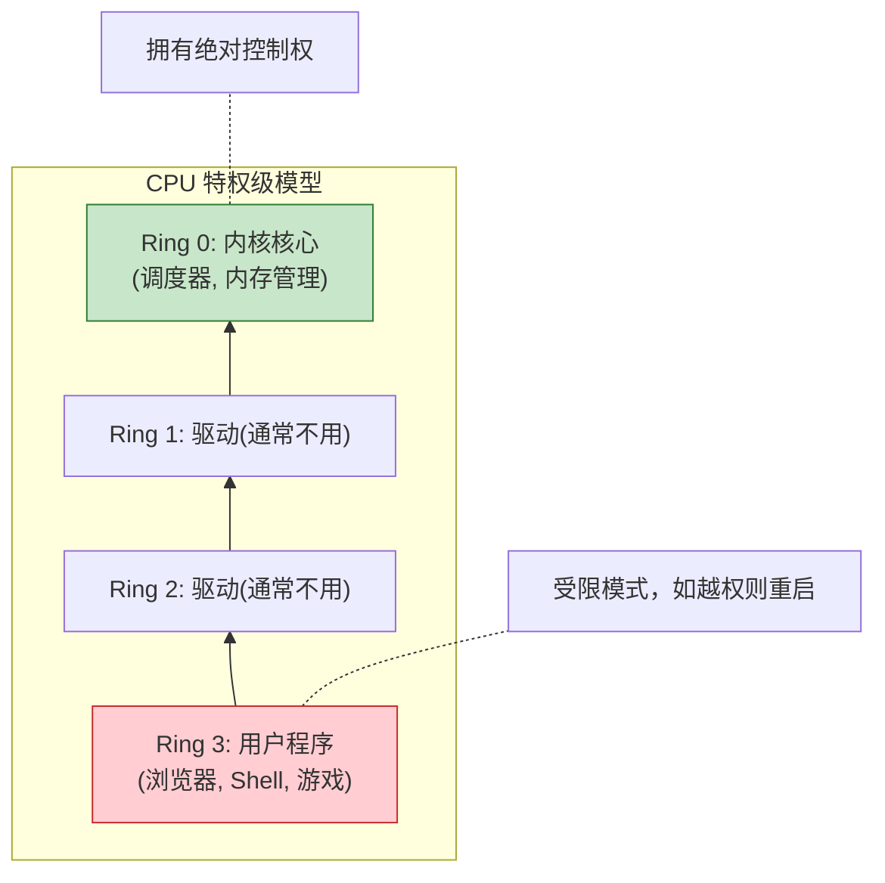
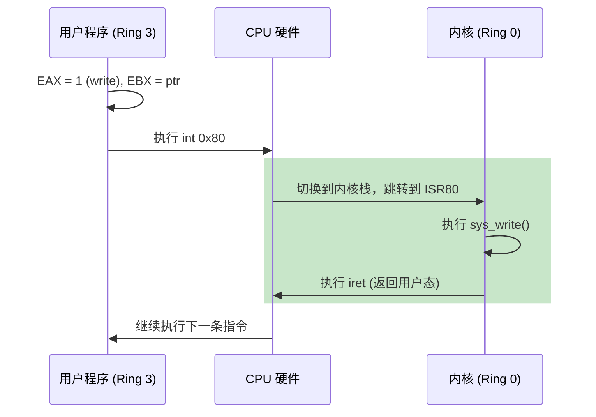

# Week 11: 用户模式 (User Mode) 与系统调用 (System Calls)

> **摘要**：本周我们将突破内核的最后一道防线。让程序不再以“上帝（内核）”的身份运行，而是作为一个受限的“普通公民（用户进程）”。我们将学习 CPU 特权级、TSS 以及让用户程序与内核交流的唯一桥梁——系统调用。

## 1. 什么是特权级 (Ring Levels)?

x86 CPU 架构提供了四个特权级，从 Ring 0 到 Ring 3：

*   **Ring 0 (内核模式)**：拥有最高权限，可以执行任何指令（如 `hlt`, `cli`, 修改 `CR3`），访问所有内存。
*   **Ring 1 & 2**：通常不被主流 OS (Linux/Windows) 使用。
*   **Ring 3 (用户模式)**：权限最低。无法直接读写硬盘、修改页表、或禁止中断。如果越权，CPU 会立即触发 **General Protection Fault (GPF)**。

## 2. 如何实现权限切换？ (The Bridge)

当一个用户程序想要打印字符到屏幕时，它不能直接操作 VGA 显存。它必须“请求”内核代劳。这个过程叫 **系统调用 (System Call)**。

### 核心机制：中断与门 (The Gate)

在 x86 中，最经典的实现方式是使用软中断 `int 0x80`。

1.  **用户态**：将“功能号”（如 1 代表打印）放入 `EAX`，参数放入其他寄存器。
2.  **执行 `int 0x80`**：CPU 捕捉到此指令，自动切换特权级到 Ring 0。
3.  **内核态**：根据 `EAX` 的值查找相应的处理函数，执行任务，然后返回。

## 3. TSS (Task State Segment)

**TSS 是权限切换的救命稻草。**

当 CPU 从 Ring 3 切换到 Ring 0 时，不仅特权变了，**堆栈也必须变**。为了安全，内核绝不能使用用户程序的堆栈。
*   **问题**：CPU 怎么知道内核堆栈在内存的哪里？
*   **答案**：**TSS**。内核会预先在 TSS 的 `esp0` 字段填入当前进程的内核栈顶地址。CPU 在切换时会自动读取这个地址。

> [!IMPORTANT]
> 在现代 32 位内核中，TSS 不再用于旧式的“硬件任务切换”，其唯一且至关重要的作用就是：**保存 Ring 0 堆栈指针**。

## 4. 下一步计划：路线图

本周我们将按以下步骤通过实战解锁 Ring 3：

1.  **设置 TSS**：在 GDT 中添加 TSS 描述符。
2.  **注册 ISR 0x80**：在 IDT 中新增一个“陷阱门”，允许 Ring 3 调用。
3.  **构造用户进程堆栈**：在内存中伪造一个特殊的“返回现场”，让 CPU 执行 `iret` 后误以为它要“返回”到 Ring 3 运行。
4.  **第一个 Syscall**：实现 `sys_write`，让用户程序能重新在屏幕上打出 "Hello User World"。

准备好从“上帝模式”降入“凡间”了吗？
