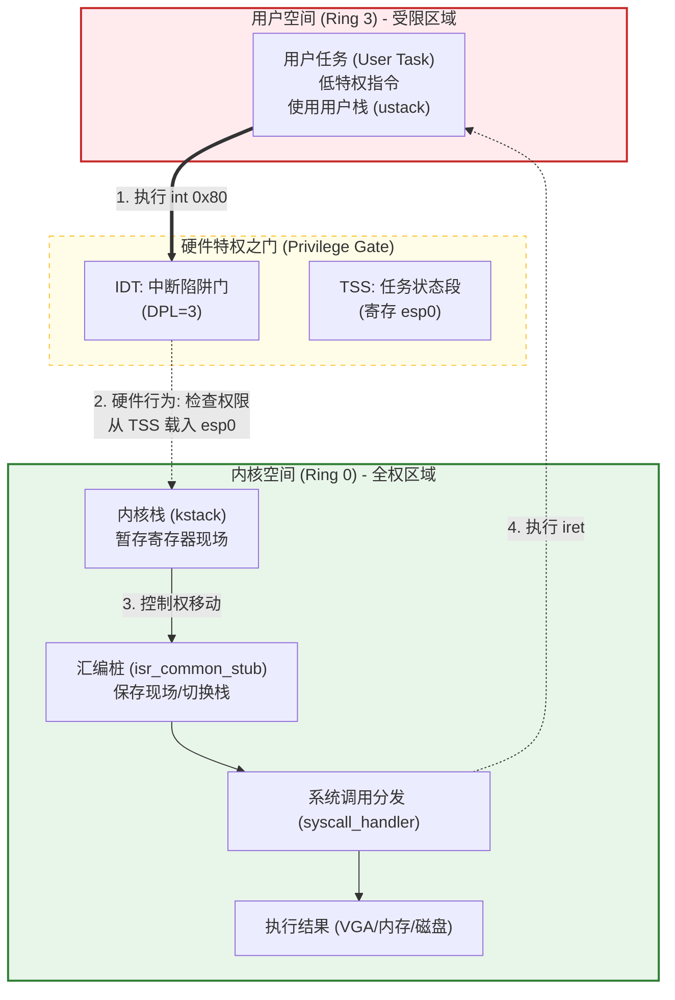

# Week 11 实战复盘：横跨 Ring 3 的权力枷锁

> **摘要**：本周我们完成了从“单特权级（Ring 0）”内核向“多特权级（User Mode）”系统的跨越。这不仅涉及代码的增删，更是一场关于硬件权限、内存保护和堆栈安全的深度博弈。

## 1. 系统分层与硬件握手架构

为了实现 Ring 3，我们将系统划分为两个物理隔离的区域，并由 CPU 硬件严格把守它们之间的边界。

### 1.1 架构全景图



### 1.2 分层详细解析

*   **用户空间 (Ring 3)**：
    *   **地位**：这里是“囚牢”。程序只能访问被标记为 `PAGE_USER` 的内存，无法执行 `hlt`, `out`, `lgdt` 等敏感指令。
    *   **堆栈**：使用独立的用户栈 (`ustack`)。这样做是为了防止用户态的栈溢出攻击直接破坏内核重要数据。

*   **硬件桥梁 (IDT & TSS)**：
    *   **鉴权**：当用户执行 `int 0x80` 时，CPU 会检查 IDT 中对应的描述符。只有当 DPL（描述符特权级）为 3 时，CPU 才会放行。
    *   **自动换栈**：这是最神奇的地方。一旦权限通过，CPU 会**自动**从 TSS 结构中读取 `esp0` 的值，并把当前的 `SS`, `ESP`, `EFLAGS`, `CS`, `EIP` 压入这个新栈。至此，代码已经安全“降落”在内核地址空间。

*   **内核空间 (Ring 0)**：
    *   **地位**：这里是“指挥部”。拥有操作所有硬件的最高权限。
    *   **职责**：汇编桩负责保存用户态剩下的寄存器（eax, ebx 等），C 函数负责逻辑分发（你要写还是读？），最后通过 `iret` 原子性地把控制权和权限等级还给用户。

---

## 2. 核心代码实现

本轮实现在架构上分为三个关键支柱：

### 2.1 任务状态段 (TSS) 与 LTR 指令
TSS 是硬件层面的“中转站”。当 Ring 3 发生中断进入内核时，CPU 会根据 TR 寄存器找到 TSS，并自动将 `esp` 切换为 `tss.esp0`。

*   **`gdt.c`**: 动态维护 TSS 描述符。
*   **`gdt.asm`**: 加载任务寄存器。

```diff
// gdt.asm: 加载任务寄存器
 .flush:
-    ret
+    mov ax, 0x28      ; GDT 第 5 项 (5*8=0x28)
+    ltr ax            ; 将 TSS 选择子加载到 TR 寄存器
+    ret
```

### 2.2 系统调用网关 (`isr.asm` & `syscall.c`)
我们使用 `int 0x80` 作为内核服务的统一入口，类似于 Linux 的机制。

*   **`interrupts.c`**: 在 IDT 中特许该门拥有 DPL 3 权限，允许低特权级代码调用。
*   **`syscall.c`**: 实现了 C 语言层面的系统调用分发，根据 `EAX` 的值执行不同内核函数。

```diff
// interrupts.c: 开启 Ring 3 到 Ring 0 的陷阱
+ #include "syscall.h"
+ // 0xEE 代表 P=1, DPL=3, Type=Trap Gate，允许用户态调用
+ idt_set_gate(128, (uint32_t)isr128, 0x08, 0xEE); 
```

### 2.3 跨越特权级墙壁 (`process.c`)
由于 CPU 不允许通过常规 `call` 或 `jmp` 提升或降级特权级，我们利用 `iret` 指令的特性：只要在栈中构造好目标环境，执行 `iret` 时 CPU 就会认为是从中断中返回。

*   **关键变换**：将 `CS` 设置为用户态选择子（`0x1B`），将 `SS/DS` 设置为用户数据选择子（`0x23`）。

```c
// process.c: 伪造 Ring 3 返回现场
uint32_t* stack_ptr = (uint32_t*)kstack_top;
*(--stack_ptr) = 0x23;          /* SS: 用户数据段 (0x20 | 3) */
*(--stack_ptr) = ustack_top;    /* User ESP */
*(--stack_ptr) = 0x202;         /* EFLAGS (保持开中断) */
*(--stack_ptr) = 0x1B;          /* CS: 用户代码段 (0x18 | 3) */
*(--stack_ptr) = (uint32_t)entry_point; /* 用户代码入口 */
```

---

## 3. 故障排查：为什么“屏幕在闪烁”？

在从 Ring 0 迈向 Ring 3 的过程中，我们遭遇了两次典型的 **Triple Fault（三重故障）**。

### 3.1 关卡一：TSS 描述符非法 (LTR 崩溃)
*   **现象**：系统一启动立即重启。
*   **原因**：在 GDT 中，TSS 的 `limit` 应为结构体大小减 1，我错误填成了内存地址。CPU `ltr` 时校验失败。
*   **修复**：`uint32_t limit = sizeof(tss_entry) - 1;`

### 3.2 关卡二：分页权限拦截 (Page Fault)
*   **现象**：系统能运行，但一切换到 Ring 3 任务就重启。
*   **深度剖析**：即便段权限允许访问，**分页硬件 (VMM)** 会进行二次检查。如果页表项的 User 位为 0，Ring 3 将无法访问该页。
*   **修复**：修改 `vmm.c` 在代码区和堆区开启 `PAGE_USER` (0x4) 标志位。
```diff
// vmm.c
- pt[i] = (i * PAGE_SIZE) | PAGE_PRESENT | PAGE_RW;
+ // 必须开启 PAGE_USER (0x4)，否则 Ring 3 指令执行和栈写入都会失败
+ pt[i] = (i * PAGE_SIZE) | PAGE_PRESENT | PAGE_RW | PAGE_USER; 
```

### 3.3 关卡三：内核/用户堆栈冲突
*   **现象**：系统不稳定，偶尔崩溃或变量被莫名覆盖。
*   **原因**：最初让两者共用一个栈。进入中断时 CPU 写入 `esp0`，会覆盖掉用户态之前压入的数据。
*   **修复**：在 `process_create_user` 中分配独立的 `kstack` 和 `ustack`。

---

## 4. 架构总结

| 特权级              | 代表选择子  | 职责                                       |
| :------------------ | :---------- | :----------------------------------------- |
| **Ring 0 (Kernel)** | 0x08 / 0x10 | 管理硬件、分配内存、调度进程。             |
| **Ring 3 (User)**   | 0x1B / 0x23 | 运行应用程序（Shell 等），受内核保护限制。 |

> [!IMPORTANT]
> **本周教训**：在保护模式下，权限是多维度的。段权限（GDT）只能决定“能不能执行”，分页权限（VMM）才能决定“能不能读写这块内存”。
