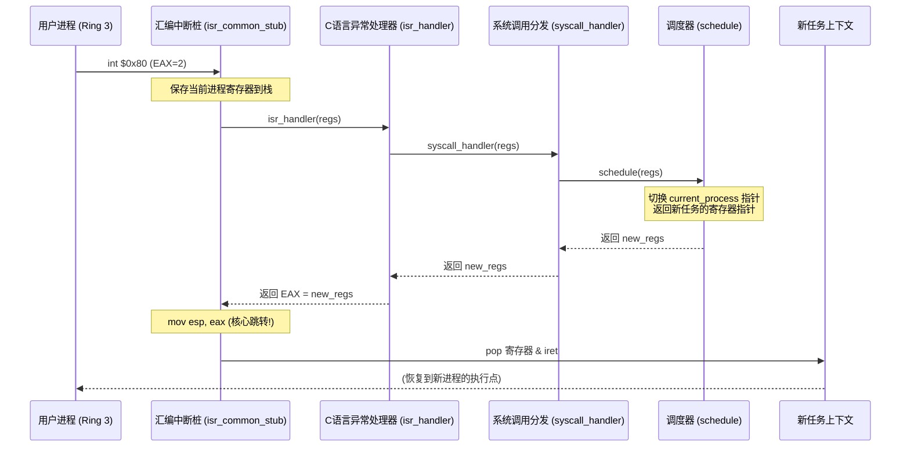
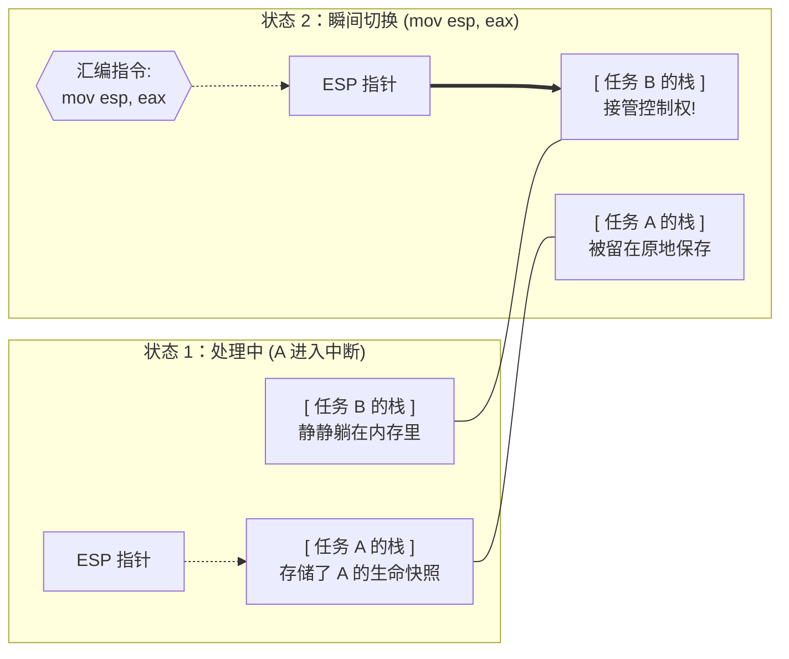

# 技术实现：sys_yield 主动让位机制

本文档详细记录了内核中 `sys_yield` 系统调用的实现细节。该功能实现了从 Ring 3 用户态主动交还控制权给调度器的机制，解决了忙等待造成的资源浪费。

## 1. 核心流程图 (Mermaid)



## 2. 核心代码变更 (Diff)

### A. 汇编底层：支持上下文切换
在 `isr.asm` 中，我们将 `isr_common_stub` 修改为支持通过返回值（EAX）切换栈指针。

```diff
[file: isr.asm]
 isr_common_stub:
-    push esp        ; 传递 struct registers* 参数
-    call isr_handler ; 调用C处理函数
-    add esp, 4      ; 清理参数
+    push esp        
+    call isr_handler ; 返回值在新进程的 regs 中
+    mov esp, eax    ; <--- 关键：通过修改 ESP 瞬间载入新任务上下文
```

### B. 系统调用分发逻辑
在 `syscall.c` 中，我们为分发函数增加了对 `yield` 的支持。

```diff
[file: syscall.c]
-void syscall_handler(struct registers* regs) {
+struct registers* syscall_handler(struct registers* regs) {
     if (regs->eax == 1) {
         sys_write((char*)regs->ebx);
+    } else if (regs->eax == 2) {
+        return schedule(regs); // 主动触发调度
     }
+    return regs;
 }
```

### C. 应用层：从“忙”到“静”
用户态任务不再浪费 CPU。

```diff
[file: kernel.c]
 void user_task(void) {
     while(1) {
-        for(volatile int i=0; i<1000000; i++); // 旧的忙等待
+        asm volatile ("mov $2, %%eax\n int $0x80" ::: "eax"); // 高效 Yield
     }
 }
```

## 3. 技术原理解析

### 为什么要修改 Assembly Stub？
在多任务操作系统中，**上下文切换（Context Switch）**的本质就是修改 `ESP` 寄存器。
- 之前的 `isr_common_stub` 假设中断结束后会回到同一个地方，所以它会清理参数并直接恢复旧寄存器。
- 修改后的 `isr_common_stub` 会查看 C 层的返回值。如果调度器决定运行另一个任务，它会返回新任务保存的 `struct registers*` 地址。`mov esp, eax` 执行后，接下来的 `popa` 和 `iret` 弹出的就是**另一个任务**的现场。

这是内核开发中最“黑盒”也最精妙的地方。要理解它，必须把**栈（Stack）**看作是进程的“生命快照”。

#### A. 栈布局示意图
这些缩写其实就是 CPU 内部的**寄存器**（可以理解为 CPU 随身带的“小抽屉”，用来存当前运行状态）。

```text
[ 任务 A 的栈 ] <---- 发生中断前的 ESP (栈顶)
+----------------+
| SS / ESP (U)   |  <- [SS: 栈地基] [ESP: 栈顶位置] (记录任务在用哪块内存当栈)
| EFLAGS         |  <- [CPU 状态标志] (比如：有没有在做减法、中断开没开)
| CS / EIP       |  <- [CS: 代码区] [EIP: 下一行指令] (记录任务刚才运行到哪行了)
| Error Code     |  <- [异常错误码] (如果没有错误则为 0)
| Interrupt No   |  <- [中断号] (比如 32 是时钟，128 是系统调用)
| EAX, ECX...    |  <- [通用寄存器] (CPU 用来算数的“草稿纸”，共有 8 个)
| DS, ES, FS, GS |  <- [数据段寄存器] (告诉 CPU 去哪儿找数据)
+----------------+ <---- 进入 C 语言时的 ESP (整个现场的起始地址)
```

**通俗解释这些“缩写”：**
- **EIP (下一行)**：这是最重要的，它指着任务 A 刚才死掉/停下的那一时刻，原本该执行哪行指令。
- **EFLAGS (状态)**：记录了 CPU 刚才的“心情”，比如上一步计算结果是不是 0。
- **EAX/EBX (草稿纸)**：任务 A 刚算到一半的数据。
- **CS/DS/SS (区地址)**：内存的“门牌号”，告诉 CPU 到哪个区域找代码、数据和栈。

#### B. 两种逻辑的本质区别

| 逻辑类型 | 汇编关键指令 | 结果说明 |
| :--- | :--- | :--- |
| **普通处理 (旧)** | `add esp, 4` | **参数清理**。这里的 `4` 代表 **4 个字节**（32 位系统下一个参数的大小）。因为我们在调用 C 语言前 `push` 了一个参数，用完后必须把栈指针往回拨 4 字节，把参数“扔掉”。但此时 `ESP` 依然指在任务 A 的地盘。 |
| **上下文切换 (新)** | `mov esp, eax` | **强行改写 `ESP`**。如果 C 语言返回了任务 B 的栈指针，`ESP` 瞬间跳到任务 B 的内存区。接下来的 `pop` 恢复的是任务 B 的状态。 |

**普通处理详细说明：**
1. 这里的 "4" 是什么？
在 32 位系统（你的内核目前就是 32 位）中，一个指针或一个标准的通用寄存器（如 EAX, ESP）的大小正好是 4 个字节。

2. 这行代码在干什么？
它的术语叫做 “清理栈上的参数”。

> 让我们看这一段汇编的逻辑顺序：

    1. push esp：我们在调用 C 函数之前，把当前的 ESP 地址压入栈。这是一次“推入”操作，栈指针 ESP 减小了 4（栈向下增长），栈上多了一个 4 字节的参数。
    2. call isr_handler：调用函数。
    3. add esp, 4：函数执行完了。那个刚才压进去传给 C 语言的参数已经没用了，所以我们通过 add ESP, 4 让栈指针往回跳 4 个字节，相当于把那个参数“扔掉”了。

3. 为什么旧方式不能切换任务？
    - 旧方式 (add esp, 4)：它只是在原地“排队”。不管 C 语言算出了什么，它都固执地把指针回拨到它进场时的位置。它永远只盯着任务 A 的栈。
    - 新方式 (mov esp, eax)：它不理会之前的偏移。它直接问 C 语言：“现在的栈顶应该是哪？”。如果 C 语言说：“现在该跑任务 B 了，栈顶在 0x1234”，那这条指令就直接把 ESP 瞬移过去了。
总结： add esp, 4 是微调（像在自己家挪了挪椅子）； mov esp, eax 是瞬移（直接搬家到了另一个任务的栈）。

**上下文切换详细说明：**
1. `mov` 指令是什么？
在汇编中，`mov` 代表 **Move**（移动），但实际上它的行为更像是 **“赋值”**。`mov esp, eax` 的意思就是：把 `eax` 寄存器里的值，强行写进 `esp` 寄存器里。

2. `eax` 里存的是什么？
根据 C 语言的调用约定（Calling Convention），**函数的返回值总是存在 `eax` 寄存器中**。
- 我们的 `isr_handler` 现在返回的是 `struct registers*`。
- 这意味着 `eax` 里存的是一个内存地址，这个地址指向某个任务保存好的“现场快照”（即它的栈顶）。

3. 这一行为什么能切换任务？
这是整套多任务系统的**最高机密**：
- **CPU 是“盲目”的**：它并不看任务的名字，它只看 `ESP`。`ESP` 指向哪里，它就认为哪里是“现在的栈”。
- **偷梁换柱**：原本 `ESP` 指向的是任务 A。但是因为执行了 `mov esp, eax`，`ESP` 被强行改成了任务 B 的地址。
- **弄假成真**：当接下来的 `popa` 和 `iret` 执行时，CPU 会从 `ESP` 指向的地方弹数据。既然 `ESP` 已经指向了 B，它就会弹出 B 之前存好的寄存器、B 的指令地址 `EIP`。
- **结果**：当 `iret` 结束的一瞬间，CPU 发现自己已经在跑任务 B 的代码了。

**比喻：**
如果说 `ESP` 是 CPU 全力关注的**“生命线”**，那么 `mov esp, eax` 就是在 CPU 眨眼的一瞬间（中断处理时），偷偷把这条线从任务 A 剪断，并接到任务 B 上的那次**“接线手术”**。

#### C. 栈切换瞬间的视觉模拟


图片说明：
- 两个透明栈（Stack A & B）：展示了内存中保存的任务数据块。
- 发光的 ESP 指针：形象地展示了 ESP 从任务 A 瞬间“跳跃”到任务 B 的过程。

我们可以把这次切换看作是一个 **“铁轨换道”** 的过程：



**底层逻辑摘要：**
汇编桩就像一个“更衣室”。任务 A 穿着制服进去（保存现场），在更衣室里 C 语言（调度器）决定下一场谁上。如果决定换人，更衣室的后门就会对准任务 B 的储物柜（`mov esp, eax`）。这样当门打开时（`popa` + `iret`），出来的就是穿着 B 制服的人了。

### Yield vs Interrupt
- **PIT 中断**：是“被动”切换，CPU 被硬件强制切走。
- **Sys_yield**：是“主动”切换，进程通过软中断告诉内核：“我目前没有紧迫工作，请调度”。

## 4. 结论
通过本次优化，内核正式具备了**协作式多任务**处理能力。这不仅提高了 Shell 的交互流畅度，也为未来实现复杂的进程同步（锁、信号量）打下了坚实的通信基础。

---
*记录人：Antigravity*
*时间：2026-01-05*
