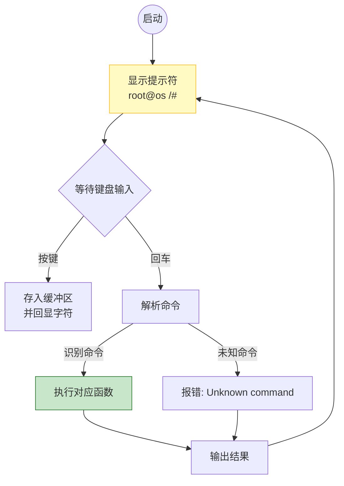
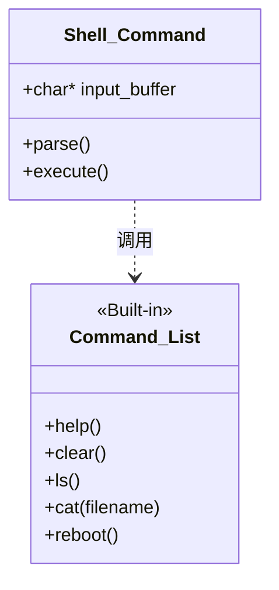

# Week 12: 交互式 Shell (Interactive Shell)

> **摘要**：本周我们将完成操作系统的“最后一公里”。我们将构建一个交互式 Shell，让你能够通过键盘输入命令，查看文件系统，甚至控制系统重启。这是从“被动执行”到“主动交互”的质变。

## 1. 什么是 Shell？

在图形界面 (GUI) 普及之前，Shell 是人类与计算机交流的唯一方式。
形象地说，**Kernel (内核)** 是坚硬的果核，负责繁杂的硬件调度；**Shell (壳)** 是包裹在外的果肉，负责将人类的自然语言转化为内核能听懂的系统调用。

### 核心循环：REPL
Shell 的本质是一个死循环，被称为 **REPL (Read-Eval-Print Loop)**：

1.  **Read (读取)**：等待用户输入一行字符，直到按下回车键。
2.  **Eval (求值)**：解析这行字符，识别命令和参数，调用对应的函数。
3.  **Print (输出)**：将命令执行结果打印到屏幕。
4.  **Loop (循环)**：显示提示符 (如 `root@myos />`)，回到第一步。

## 2. 键盘输入的挑战：生产者-消费者模型

在之前的课程中，我们只是简单地把键盘扫描码打印到屏幕上。但在 Shell 中，我们需要**存储**这些字符，直到用户按下回车。

这里涉及两个角色的协作：
1.  **生产者 (中断处理程序)**：用户按下键盘 -> 触发 IRQ1 -> 读取扫描码 -> 转换为 ASCII -> **放入缓冲区**。
2.  **消费者 (Shell 程序)**：循环检查缓冲区 -> 取出字符 -> 拼接到命令字符串中。

> [!NOTE]
> **退格键 (Backspace)** 的处理稍微复杂：它不仅要从屏幕上擦除一个字符，还要从内存缓冲区中删除最后一个字符。

## 3. 字符串解析：教内核识字

内核目前只认识二进制。为了让它理解 "cat hello.txt"，我们需要实现简易的字符串处理库：

*   `strcmp(s1, s2)`: 判断两个字符串是否相等（用于匹配命令）。
*   `strlen(s)`: 计算长度。
*   `strsplit(s)`: 将长句拆分为单词（Tokenizing）。

## 4. 实战目标：实现基础命令集

本周我们将实现以下内置命令：

| 命令 | 描述 | 依赖模块 |
| :--- | :--- | :--- |
| `help` | 显示可用命令列表 | Terminal |
| `clear` | 清空屏幕，光标归位 | Terminal |
| `ls` | 列出当前目录下的文件 | VFS / InitRD |
| `cat <file>` | 打印文件内容 | VFS / InitRD |
| `reboot` | 重启计算机 | CPU IO 端口 |

## 5. 准备工作

我们需要创建一个新的源文件 `shell.c`，并修改 `keyboard.c` (或 `interrupts.c`) 以便将按键事件传递给 Shell，而不是直接打印。