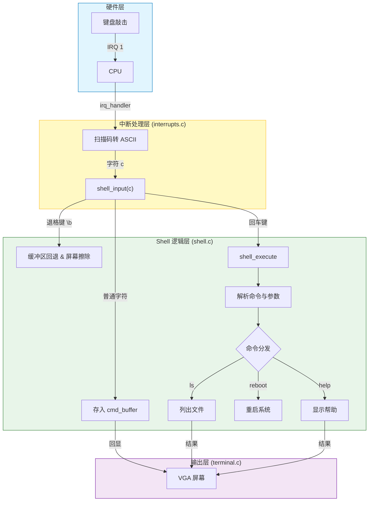

# Week 12 实战复盘：交互式 Shell 的诞生

> **摘要**：本周我们将内核从“哑巴”变成了“对话者”。通过实现字符串库、Shell 缓冲区管理以及键盘中断的重定向，我们成功构建了一个支持 `ls`, `cat`, `reboot` 等命令的交互式终端。

## 1. 交互逻辑架构

Shell 的核心在于如何处理异步的键盘中断与同步的命令执行。我们需要一个缓冲区来暂存用户的按键，直到按下回车键才触发解析。

### 交互流程图



### 关键逻辑说明

1.  **生产者 (中断)**：`interrupts.c` 不再直接把字符打印到屏幕，而是调用 `shell_input(c)`。
2.  **消费者 (Shell)**：
    *   **回显 (Echo)**：用户输入字符时，Shell 负责将其打印到屏幕，让用户看到自己输了什么。
    *   **缓冲 (Buffer)**：字符被存入 `cmd_buffer` 数组。
    *   **退格 (Backspace)**：处理 `\b` 时，不仅要移动光标打印空格覆盖，还要减少 `cmd_len`。
3.  **执行 (Execute)**：按下回车后，`shell_execute` 将缓冲区字符串视为命令，与内置命令列表 (`strcmp`) 进行匹配并执行。

## 2. 核心代码改动

### 2.1 基础设施：字符串库 (`string.c`)
内核没有标准库，我们需要自己造轮子。为了避免与 `terminal.c` 中临时的 `strlen` 冲突，我们进行了重构。

```diff
--- terminal.c
+++ terminal.c
@@ -1,5 +1,6 @@
 #include "terminal.h"
 #include <stddef.h>
+#include "string.h" // 引入通用字符串库
 
 // ... (省略)
 
-// 删除旧的 strlen 实现，统一使用 string.c
-size_t strlen(const char* str) {
-    size_t len = 0;
-    while (str[len])
-        len++;
-    return len;
-}
```

### 2.2 中断重定向 (`interrupts.c`)
我们将键盘输入的字符流从“直接打印”改为“喂给 Shell”。

```diff
--- interrupts.c
+++ interrupts.c
@@ -6,6 +6,7 @@
 #include "process.h"
 #include "syscall.h"
+#include "shell.h"
 
 // ...
 
     if (regs->int_no == 33) {
         // ... (获取扫描码 sc)
         char c = translate_scancode(sc, shift_on, caps_on);
         shift_on_global = shift_on;
-        if (c) { terminal_putchar(c); key_count++; }
+        if (c) { shell_input(c); key_count++; } // 将输入重定向到 Shell
         return regs;
     }
```

### 2.3 Shell 核心逻辑 (`shell.c`)
实现了缓冲区管理和简单的命令解析器。

```c
/* shell.c 核心片段 */
void shell_input(char c) {
    if (c == '\n') {
        shell_execute(); // 回车触发执行
    } else if (c == '\b') {
        if (cmd_len > 0) {
            cmd_len--;
            // 视觉上的退格：退格 -> 空格 -> 退格
            terminal_putchar('\b');
            terminal_putchar(' ');
            terminal_putchar('\b');
        }
    } else {
        // 存入缓冲区并回显
        if (cmd_len < CMD_BUF_SIZE - 1) {
            cmd_buffer[cmd_len++] = c;
            terminal_putchar(c);
        }
    }
}
```

### 2.4 内核启动项 (`kernel.c`)
在开启中断前初始化 Shell，打印提示符。

```diff
--- kernel.c
+++ kernel.c
@@ -9,6 +9,7 @@
 #include "process.h"
 #include "initrd.h"
+#include "shell.h"
 
 // ...
 
     terminal_writestring("IDT initialized successfully!\n\n");
     status_refresh();
     
+    /* 初始化 Shell */
+    shell_init();
+
     terminal_writestring("System ready! Interrupts enabled.\n");
```

### 2.5 构建系统 (`build.sh`)
别忘了编译新文件。

```diff
--- build.sh
+++ build.sh
@@ -20,9 +20,11 @@
 x86_64-elf-gcc -m32 -ffreestanding -nostdlib -c process.c -o process.o
 x86_64-elf-gcc -m32 -ffreestanding -nostdlib -c initrd.c -o initrd.o
 x86_64-elf-gcc -m32 -ffreestanding -nostdlib -c syscall.c -o syscall.o
+x86_64-elf-gcc -m32 -ffreestanding -nostdlib -c string.c -o string.o
+x86_64-elf-gcc -m32 -ffreestanding -nostdlib -c shell.c -o shell.o
 
 # 链接所有目标文件
-x86_64-elf-ld -r -m elf_i386 -o core.o kernel.o interrupts.o ... syscall.o
+x86_64-elf-ld -r -m elf_i386 -o core.o kernel.o ... syscall.o string.o shell.o
```

## 3. 成果展示

现在，我们的操作系统不再是一个只会打印日志的黑盒子。你可以输入 `help` 查看命令，输入 `reboot` 重启系统，或者用 `cat hello.txt` 查看文件内容。

这是迈向用户空间交互的第一步！