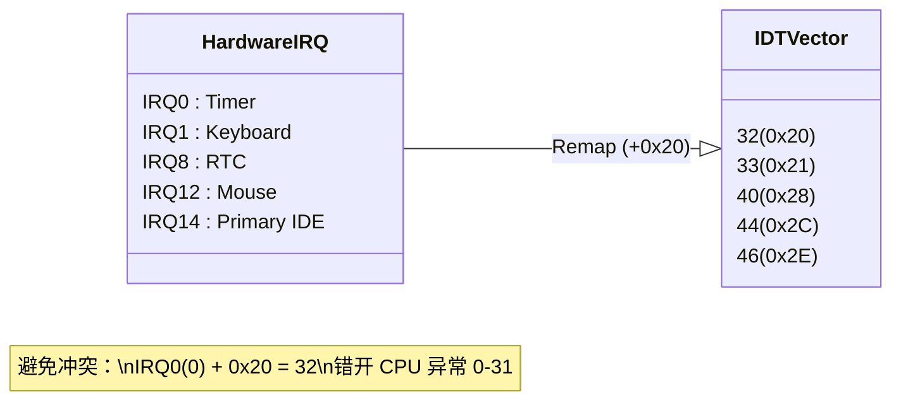
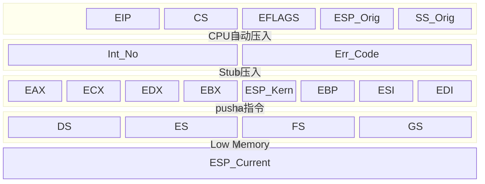
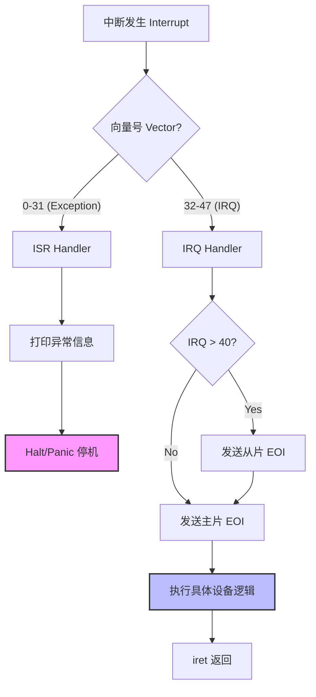

# 第4周：中断处理系统图文讲解

> 目标：从硬件信号到内核 C 处理函数的完整路径，涵盖 IDT 建立、异常（ISR）与硬件中断（IRQ）分发、PIC 重映射与 EOI、以及当前项目的实际行为与验证方法。

## 概览
- 建立 `IDT` 并为异常 `0–31` 与硬件中断 `32–47` 设置门项。
- 通过 `isr.asm` 提供 ISR/IRQ 汇编入口，将寄存器快照打包为 `struct registers*` 传递到 C 层。
- 通过 `PIC` 重映射把 `IRQ0–15` 对齐到 `IDT` 向量 `32–47`，避免与 CPU 异常区间冲突。
- C 层行为：异常统一打印并停机；断点 `int 3` 特殊显示；IRQ 发送 EOI 并打印向量号，临时忽略时钟刷屏。
- 内核在启动流程中初始化 `GDT`、`IDT`、注册 ISR/IRQ，`sti` 使能中断，并触发 `int 3` 进行可视化验证。

### 流程说明
1.  **硬件/异常触发**：CPU 暂停当前指令流。
2.  **IDT 查表**：根据中断号获取 ISR 入口地址（`isr.asm`）。
3.  **汇编桩（Stub）**：保存所有寄存器（`pusha`），构建 `struct registers`。
4.  **C内核处理**：根据中断号分发给 `isr_handler` (异常) 或 `irq_handler` (设备)。
5.  **EOI & 恢复**：如果是硬件中断发送 EOI，最后 `iret` 弹栈恢复现场。

## 启动与初始化
- 内核主函数初始化顺序：`GDT` → `IDT` → `ISR/IRQ` → `PIT` → 使能中断。
  - 在 `kernel.c:kmain` 中依次调用 `idt_init`、`isr_init`、`irq_init`、`pit_init(100)`。
  - 在 `kernel.c:kmain` 尾部执行 `sti` 使能中断。

## IDT 与门项
- 结构体定义：`idt.h:7–13` 描述 `base_low/sel/flags/base_high`。
- 初始化与加载：
  - 在 `idt.c:idt_init` 设置 `idtp`，清空 256 项后通过 `isr.asm:idt_flush` 加载。
- 门项安装：
  - 异常 `0–31`：在 `interrupts.c:isr_init` 注册 `isr0..isr31`。
  - IRQ `32–47`：在 `interrupts.c:irq_init` 注册 `irq0..irq15`。
- 标志 `0x8E`：表示“存在位=1、DPL=0、类型=0xE（32位中断门）”，选择子 `0x08` 指向内核代码段。

### 门项细节
- **Selector (16-31)**：必须指向内核代码段选择子（通常是 `0x08`），保证在内核特权级运行。
- **Type (40-47)**：`0x8E` 是关键。
    - `P=1`：存在。
    - `DPL=0`：特权级 0（用户态不可直接调用，除非通过软中断门）。
    - `Gate=0xE`：32位中断门（会自动关中断）。

## PIC 重映射与 IRQ 区间
- 原始 8259 PIC 将 `IRQ0–7` 映射到 `0x08–0x0F`，与 CPU 异常区间 `0x00–0x1F` 冲突。
- 通过 `interrupts.c:pic_remap` 将主/从 PIC 偏移设置为 `0x20`/`0x28`。
- 关键端口与步骤详见 `interrupts.c:pic_remap`。
  - 读取并保存掩码：`PIC1_DATA(0x21)`、`PIC2_DATA(0xA1)`。
  - 发送 `ICW1/2/3/4` 完成重映射与 8086 模式设置。
  - 恢复原掩码，避免误启用未期望的 IRQ。

**完整映射表**：
| IRQ   | 用途         | IDT 向量  | 备注      |
| :---- | :----------- | :-------- | :-------- |
| IRQ0  | **PIT 时钟** | 32 (0x20) | 系统心跳  |
| IRQ1  | **Keyboard** | 33 (0x21) | PS/2 键盘 |
| IRQ2  | 级联 8259    | 34 (0x22) | 连接从片  |
| IRQ8  | CMOS RTC     | 40 (0x28) | 实时钟    |
| IRQ12 | PS/2 Mouse   | 44 (0x2C) | 鼠标      |
| IRQ14 | Disk 1       | 46 (0x2E) | 主硬盘    |
| IRQ15 | Disk 2       | 47 (0x2F) | 从硬盘    |

## 汇编入口与通用桩
- ISR/IRQ 模板：见 `isr.asm:ISR_NOERRCODE`、`isr.asm:ISR_ERRCODE`、`isr.asm:IRQ`。
- 通用桩保存现场并切换到内核数据段：`isr.asm:isr_common_stub`、`isr.asm:irq_common_stub`。
- 通过 `push esp` 向 C 层传递 `struct registers*`，返回路径 `iret` 同样在上述通用桩中实现。

> **注**：`struct registers` 指针即指向栈顶（ESP_Current），C 语言通过这个指针可以访问并修改栈中保存的任何寄存器值（例如修改 EIP 实现任务切换）。

## C 层行为与可视化
- 异常处理：`interrupts.c:isr_handler` 顶行显示 `EXC XX` 并停机。
- IRQ 处理：`interrupts.c:irq_handler`。
  - 按从→主顺序发送 `EOI`：当 `int_no >= 40` 先 `0xA0` 后 `0x20`。
  - 时钟 `IRQ0`：累加 `ticks` 并周期刷新顶行状态栏文本。
  - 键盘 `IRQ1`：读取 `0x60` 扫描码，处理 `Shift/Caps/Backspace/Enter` 并回显；其余 IRQ 打印向量号。

## 关键结构
- `struct registers`：`interrupts.h:7–12`，完整保存段寄存器、通用寄存器、向量号、错误码、返回现场。
- `struct idt_entry`：`idt.h:7–13`，描述每个门项的地址与属性。

## 当前完成度与待完善
- 键盘：尚未解析扫描码，只记录向量号；可在 `IRQ1` 读取 `0x60` 扫描码并映射字符。
- 时钟：未做调度或节拍计数；后续可注册 `tick` 计数与任务切换钩子。
- 异常：统一停机；后续可为常见异常（页错误、通用保护等）打印寄存器详情与恢复策略。

## 快速验证
- 启动后提示测试键盘中断：详见 `kernel.c:kmain`。
- 顶行右侧状态栏文本周期刷新：`Hz/Ticks/Keys/Caps/Shift`。
- 键盘字母按 `Shift/Caps` 大小写回显，`Backspace/Enter` 正常工作。

---

### 附：API 索引（用于查阅源代码）
- `kmain` 启动流程：`kernel.c:kmain`
- `idt_set_gate`：`idt.c:idt_set_gate`
- `idt_init` 与 `lidt`：`idt.c:idt_init`、`isr.asm:idt_flush`
- `isr_init`（异常注册）：`interrupts.c:isr_init`
- `pic_remap`：`interrupts.c:pic_remap`
- `irq_init`（硬件中断注册）：`interrupts.c:irq_init`
- `isr_handler`：`interrupts.c:isr_handler`
- `irq_handler`：`interrupts.c:irq_handler`
- `ISR/IRQ 汇编入口与通用桩`：`isr.asm:ISR_NOERRCODE`、`isr.asm:ISR_ERRCODE`、`isr.asm:IRQ`、`isr.asm:isr_common_stub`、`isr.asm:irq_common_stub`
