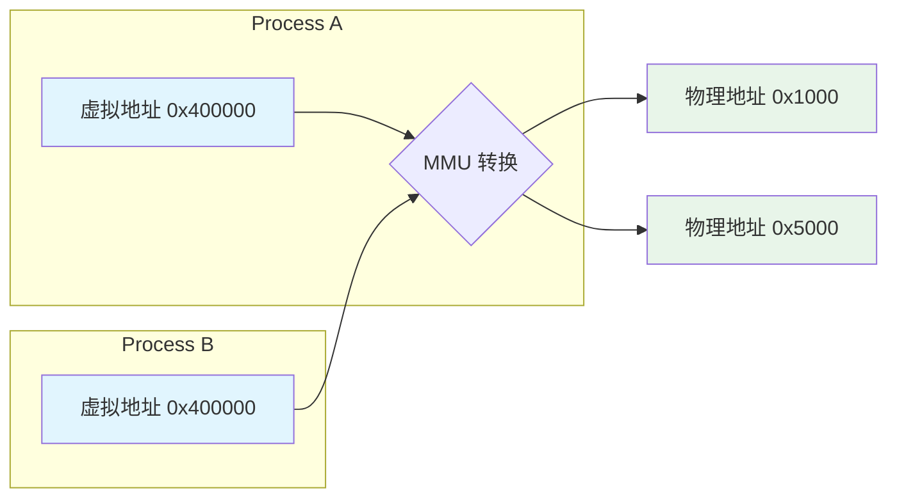
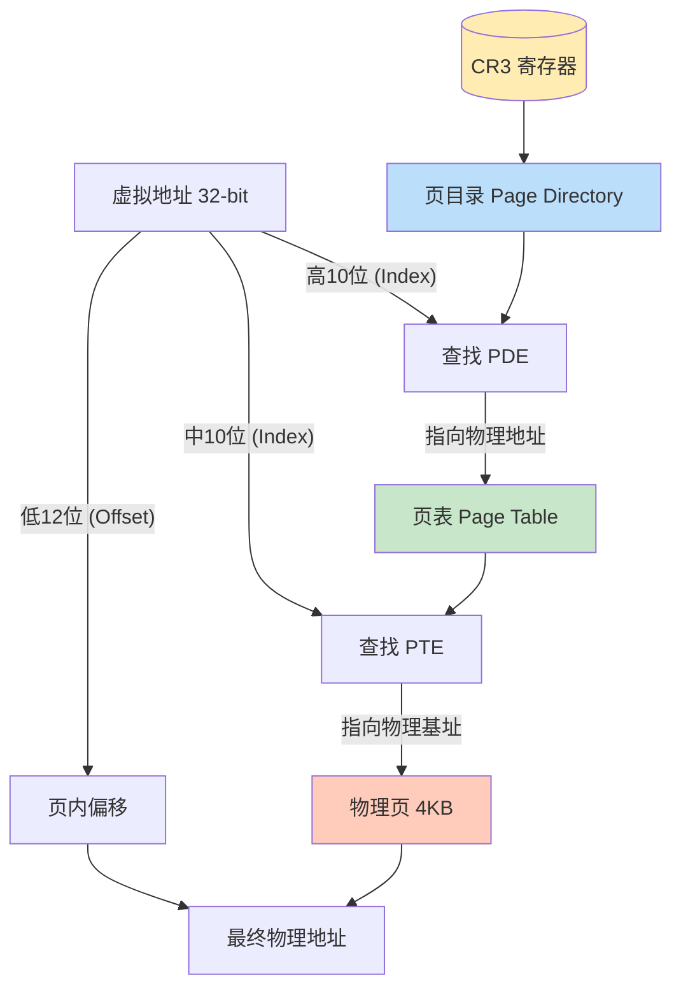
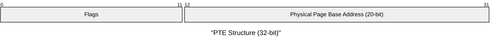
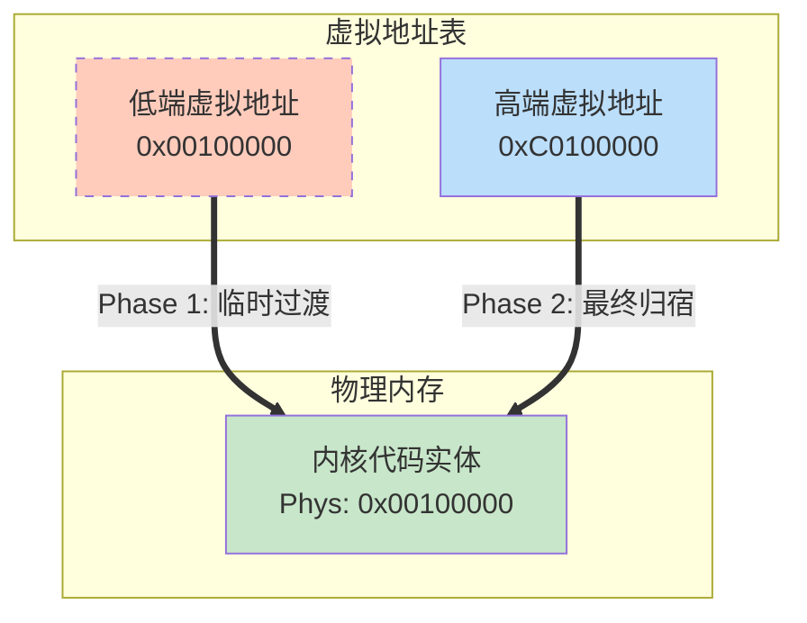

# 第7周：虚拟内存管理 (VMM) 理论

> **目标**：理解保护模式下的分页机制，掌握从“物理地址”到“虚拟地址”的跃迁，以及如何构建“高半核 (Higher-half Kernel)”模型。

## 1. 为什么需要 VMM？

在物理内存管理 (PMM) 阶段，我们直接操作物理地址。但这在多任务操作系统中存在巨大隐患：
1.  **缺乏隔离**：进程 A 可能恶意或意外地读写进程 B（甚至内核）的内存。
2.  **地址碎片**：程序需要连续的内存空间，但物理内存可能支离破碎。
3.  **地址硬编码**：每个程序都希望自己加载到固定的内存地址（如 `0x08048000`），如果直接用物理内存，这显然不可能。

**虚拟内存 (Virtual Memory)** 通过引入一个**中间层**解决了这些问题：
- 每个进程拥有独立的 **4GB 虚拟地址空间** (32-bit)。
- 程序看到的地址是“幻觉”，CPU 在访问内存时自动将其翻译为物理地址。

## 2. x86 分页机制 (Paging)

x86 架构在保护模式下使用 **二级分页结构** 来实现 32 位地址空间的映射。

### 核心组件
1.  **CR3 寄存器**：存储**当前页目录的物理地址**。CPU 每次进行地址转换都从这里开始。
2.  **页目录 (Page Directory, PD)**：包含 1024 个 PDE (Page Directory Entry)。每个 PDE 指向一个页表。
3.  **页表 (Page Table, PT)**：包含 1024 个 PTE (Page Table Entry)。每个 PTE 指向一个 4KB 的物理页。

### 地址转换流程

CPU 如何将一个虚拟地址（例如 `0xC0000000`）转换成物理地址？这一过程完全由硬件（MMU）自动完成，但前提是我们填好了表。

假设 `CR3` 指向物理地址 `0x1000` 的页目录。我们来看虚拟地址 `0xC0000000` 的拆解：

1.  **拆分地址**：
    *   32位二进制：`11000000 00000000 00000000 00000000`
    *   **高 10 位 (Index 768)**：`1100000000` = `0x300` (十进制 768)。这是**页目录索引**。
    *   **中 10 位 (Index 0)**：`0000000000` = `0x0`。这是**页表索引**。
    *   **低 12 位 (Offset 0)**：`000000000000` = `0x0`。这是**页内偏移**。

2.  **查找页目录 (Layer 1)**：
    *   CPU 拿着索引 `768`，去 `CR3(0x1000)` 指向的数组里找第 768 个条目 (PDE)。
    *   假设 PDE 内容是 `0x2000` (且 Present=1)，意味着对应的**页表**在物理地址 `0x2000`。

3.  **查找页表 (Layer 2)**：
    *   CPU 拿着索引 `0`，去物理地址 `0x2000` 的页表里找第 0 个条目 (PTE)。
    *   假设 PTE 内容是 `0x3000` (且 Present=1)，意味着最终的**4KB物理页**在 `0x3000`。

4.  **合成物理地址**：
    *   基地址 `0x3000` + 偏移量 `0` = `0x3000`。
    *   **结果**：CPU 访问虚拟地址 `0xC0000000`，实际读写的是物理地址 `0x3000`。

## 3. 页表项结构 (PTE/PDE)

PDE 和 PTE 的结构非常相似，都是 32 位整数，包含**物理基地址**和**属性标志位**。

**关键标志位 (Flags)**：
- **P (Present, Bit 0)**：1=存在，0=不存在（访问触发 #PF 缺页异常）。
- **R/W (Read/Write, Bit 1)**：1=可读写，0=只读。
- **U/S (User/Supervisor, Bit 2)**：1=用户态可访问，0=仅内核态可访问。
- **A (Accessed, Bit 5)**：CPU 访问过该页后自动置 1。
- **D (Dirty, Bit 6)**：CPU 写入过该页后自动置 1（仅 PTE 有效）。

## 4. 高半核 (Higher-half Kernel) 设计

为了让用户程序和内核共存，我们通常将 4GB 虚拟空间一分为二：
- **用户空间 (User Space)**：`0x00000000` ~ `0xBFFFFFFF` (低 3GB)
- **内核空间 (Kernel Space)**：`0xC0000000` ~ `0xFFFFFFFF` (高 1GB)

这意味着：**无论切换到哪个进程，高 1GB 的映射始终不变，指向同一个物理内核。**

### 映射策略详解：为什么需要“双重身份”？

我们希望内核最终运行在 `0xC0000000` (3GB) 以上的高地址，但内核也是一段普通代码，最初是被加载到物理低地址（如 `0x100000`）开始运行的。

这就面临一个**搬家**的难题：开启分页是一瞬间的事，如果这一秒还在执行低地址的代码，下一秒 CPU 突然认为“地址是虚拟的”，原本合法的低地址可能瞬间变得无效（缺页异常），系统直接崩溃。

为了平滑过渡，我们采用**克隆/双重映射**策略：

1.  **准备阶段（制造克隆）**：
    *   我们在页表里填两份记录。
    *   **低端恒等映射 (Identity Mapping)**：告诉 CPU，“虚拟地址 `0x00100000` 就在物理地址 `0x00100000`”。这是为了保证开启分页那一刻，CPU 还能找得到当前指令。
    *   **高端映射 (Higher-half Mapping)**：告诉 CPU，“虚拟地址 `0xC0100000` 也在物理地址 `0x00100000`”。这是我们真正想去的“新家”。
    *   此时，物理内存里的同一份代码，有两个“虚拟身份”。

2.  **开启分页（Switch）**：
    *   设置 `CR0` 寄存器。此时 `EIP` 指令指针还在低地址（如 `0x00100020`）。
    *   因为我们做了恒等映射，CPU 查表发现 `0x00100020` 依然有效，**系统没崩！**

3.  **飞跃（Leap）**：
    *   执行一个长跳转指令 `jmp 0xC010xxxx`。
    *   CPU 被强制跳转到高地址执行。查表发现 `0xC010xxxx` 也映射到那块物理内存，执行继续。
    *   此刻起，内核成功“搬家”到了高地址。

4.  **拆桥（Unmap）**：
    *   为了安全（避免空指针引用），我们把低端的恒等映射删除。
    *   从此，内核代码只能通过高虚拟地址访问。

## 5. 实现步骤预告
1.  **准备页目录**：申请一页物理内存作为 PD。
2.  **填充 PDE**：
    - 映射低端 4MB（恒等映射，为了过渡）。
    - 映射高端 3GB+（映射到同样的低端物理页）。
3.  **加载 CR3**：将 PD 的**物理地址**载入 CR3。
4.  **启用分页**：置位 CR0 寄存器的 `PG` 位 (Bit 31)。
5.  **验证**：尝试访问 `0xC0000000` 以上的地址，看是否 crash。

---
**下一阶段任务**：编写 VMM 代码，实现上述映射逻辑，让内核“搬家”到高地址运行。
