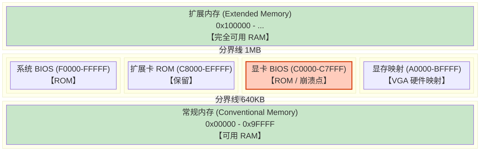

# Week 7 进阶：内存黑洞与 E820 地图

> **背景**：在实现 PMM/VMM 时，我们遇到了 `0xC0000` 附近的 Triple Fault 崩溃。这引出了 x86 架构中一个古老但至关重要的概念 —— **上位内存区 (UMA, Upper Memory Area)**。

## 1. 事故复盘：为什么会在 `0xC0000` 崩溃？

### 现象
PMM 初始化时，如果不加保留区，会顺次分配出 `0x000C0000` 作为物理页。当 VMM 试图往这个页写入页表数据时，CPU 抛出三重故障 (Triple Fault) 重启。

### 原因
物理地址 `0x000C0000` 到 `0x000C7FFF` 是 **显卡 BIOS (Video BIOS)** 的驻留地。
- 这是一块 **ROM (Read-Only Memory)**。
- 写入无效（被忽略或引发总线错误）。
- 将页表放在这里 = 页表数据丢失 = CR3 指向空数据 = 映射失败 = 崩溃。

## 2. 详解：PC 内存的“三八线” (640KB - 1MB)

从 IBM PC 时代开始，物理内存的前 1MB 就被严格划分。其中 `0xA0000` 到 `0xFFFFF` 这 **384KB** 区域被称为 UMA，里面布满了“地雷”。



### 关键区域说明
- **0x00000 - 0x9FFFF (640KB)**：真正的 RAM。但最前面几 KB 存有 IVT (中断向量表) 和 BDA (BIOS 数据区)。
- **0xA0000 - 0xBFFFF (128KB)**：显存窗口。往这写数据会直接显示在屏幕上（VGA 模式）。
- **0xC0000 - 0xC7FFF (32KB)**：显卡 BIOS ROM。
- **0xF0000 - 0xFFFFF (64KB)**：主板 BIOS ROM。

## 3. 解决方案：从“一刀切”到“精准制导”

### 方案 A：一刀切 (MVP 当前做法)
**策略**：既然 1MB 以下这么乱，干脆全都不用。
**实现**：
```c
// pmm.c
reserve_range(0x00000000, 0x00100000); // 1MB 以下全是禁区
```
**优点**：代码极其简单，绝对安全。
**缺点**：浪费了低端约 600KB 的可用 RAM（对于现代大内存无所谓）。

### 方案 B：精准制导 (E820 内存探测)
**策略**：不靠猜，直接问 BIOS。
**机制**：在操作系统进入保护模式**之前**（即 `boot.asm` 的 16 位阶段），利用 BIOS 中断 `int 0x15, eax=0xE820` 获取一张 **内存地图 (E820 Map)**。

#### E820 条目结构
BIOS 会返回一个结构体数组，每个条目包含：
1.  **Base Address** (64-bit)：区域起始地址。
2.  **Length** (64-bit)：区域长度。
3.  **Type** (32-bit)：
    *   `1 = USABLE` (可用 RAM)
    *   `2 = RESERVED` (不可用，如 ROM、映射IO)
    *   `3 = ACPI RECLAIM` (ACPI 表)
    *   `...`

#### 实操蓝图
1.  **Bootloader 阶段**：
    - 循环调用 `int 0x15`，将获取到的条目一个接一个写到物理内存的一个固定位置（例如 `0x8000`）。
    - 记录条目总数。
2.  **Kernel PMM 阶段**：
    - `pmm_init` 不再假设内存是 64MB。
    - 读取 `0x8000` 处的数组。
    - 遍历数组：
        - 如果 `Type == 1`，则调用 `free_region(base, length)` 把这些也没加入空闲池。
        - 甚至可以自动发现 1MB 以下那些破碎但可用的 RAM。

## 4. 总结
在编写 OS 时，**“能够编译通过”** 和 **“能够正确运行”** 是两码事。硬件内存布局是一个典型的“隐形契约”，必须严格遵守。在 MVP 阶段，**保守策略**（保留前 1MB）是规避复杂性的最佳实践。
