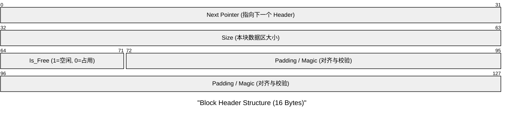
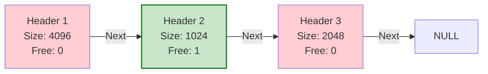
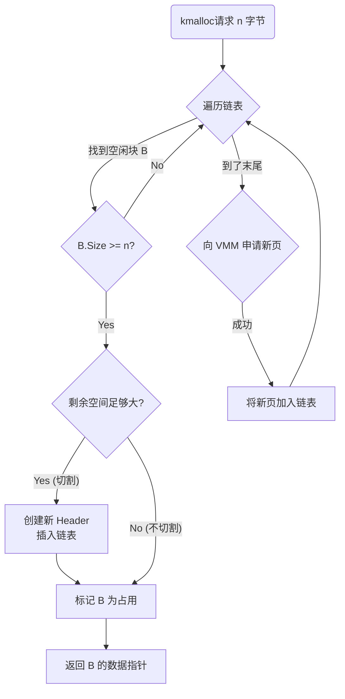
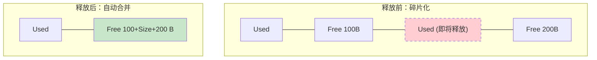

# 第8周：内核堆管理 (Heap Management) 理论

> **目标**：实现动态内存分配。从“静态数组”进化到“按需分配”，让内核拥有 `kmalloc` 和 `kfree` 能力。

## 1. 为什么需要堆 (Heap)？

在没有堆之前，我们的内存使用极其受限：
1.  **全局变量**：必须在编译时确定大小（如 `uint8_t buffer[1024]`）。如果数据突然变大，会溢出；如果用不完，则浪费。
2.  **栈变量**：生命周期仅限于函数内部，函数返回即销毁，无法持久存储。

**堆 (Heap)** 提供了一个巨大的、可动态伸缩的内存池：
- **按需索取**：想要 10 字节还是 10MB？运行时说了算。
- **持久存在**：直到你显式调用 `free`，数据永远存在。

## 2. 核心架构：链表分配器 (Linked List Allocator)

我们将采用最经典且易于理解的 **显式空闲链表 (Explicit Free List)** 管理策略。

### 2.1 内存块结构
堆上的每一块内存（无论是已分配的还是空闲的），都由两部分组成：
1.  **元数据头 (Header)**：记录这一块的大小、状态、以及链表指针。
2.  **数据区 (Data)**：真正返回给用户的内存。

### 2.2 堆的形态
整个堆就像一列火车，由一个个内存块首尾相连组成。

*   **绿色**：空闲块（Free）。
*   **红色**：已分配块（Used）。

## 3. 分配算法：首次适应 (First Fit)

当用户请求 `kmalloc(size)` 时：
1.  **遍历**：从头开始扫描链表。
2.  **寻找**：找到**第一个**满足 `Block.Size >= size` 且 `Is_Free == 1` 的块。
3.  **切割 (Split)**：如果这个块太大（例如你只要 16 字节，它有 4KB），就把它切成两半：
    *   **前半部分**：标记为“占用”，返回给用户。
    *   **后半部分**：变成一个新的 Header，标记为“空闲”，插入链表。

## 4. 回收算法：合并 (Coalescing)

当用户调用 `kfree(ptr)` 时：
1.  **定位**：根据 `ptr` 向前回溯找到 Header。
2.  **标记**：将 `Is_Free` 置为 1。
3.  **合并 (Merge)**：为了防止碎片化，检查它的**前一个**和**后一个**邻居：
    *   如果邻居也是空的，就拔掉中间的栅栏，把它们融合成一个大块。

## 5. 与 VMM 的协作

堆不是凭空产生的，它必须向 VMM 申请物理内存。
*   **初始阶段**：堆初始化时，向 VMM 申请 1 页 (4KB) 作为初始池。
*   **扩容阶段**：当 `kmalloc` 找不到足够大的块时，堆管理器通过 `alloc_page` 申请新的物理页，映射到虚拟地址空间的堆尾部，从而延长“火车”。

---

### 下一阶段任务
我们将实现 `heap.c`，构建这个链表管理器，并支持 `kmalloc` 和 `kfree`。
