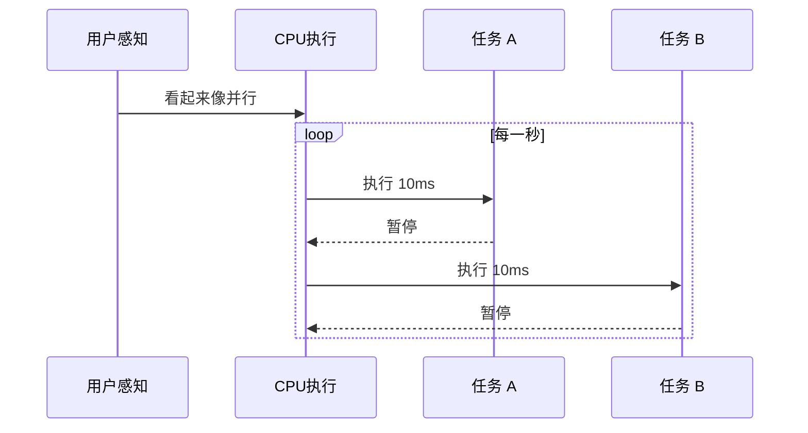
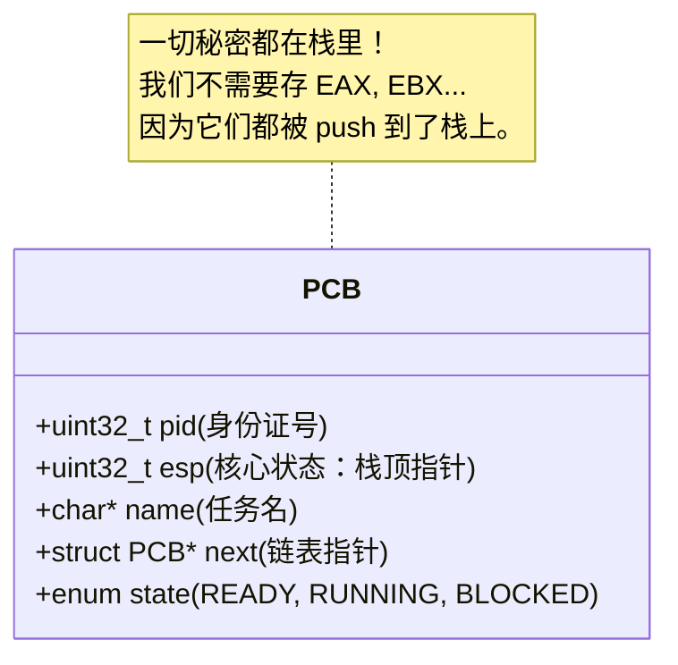
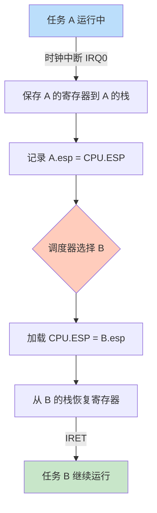
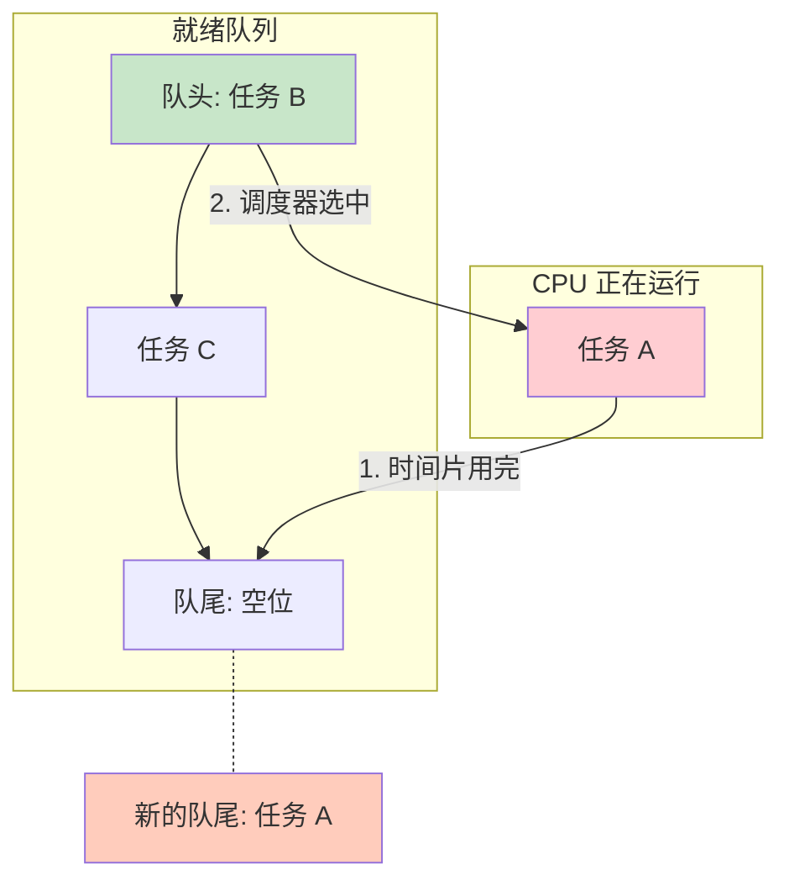

# 第9周：多任务处理 (Multitasking) 理论

> **目标**：打破“单线程”的诅咒，让操作系统能同时（看似）运行多个任务。这就是 **并发 (Concurrency)** 的幻觉。

## 1. 并发的幻觉 (The Illusion)

只要切换得足够快，用户就感觉不到暂停。
就像电影胶片每秒播放 24 张图一样，CPU 每秒在不同任务间切换 1000 次，这就叫 **多任务**。

## 2. 核心数据结构：PCB (Process Control Block)

为了暂停并恢复一个任务，我们需要把它的所有状态都存起来。这个状态包就叫 **PCB** 或 **TCB (Thread Control Block)**。

对于内核级线程，最关键的状态是 **寄存器**，尤其是 **ESP (栈指针)**。

## 3. 上下文切换 (Context Switch)

这是多任务的心脏。当 **时钟中断 (Timer Interrupt)** 到来时，会发生以下惊心动魄的一幕：

1.  **打断 (Interrupt)**：CPU 收到时钟信号，自动将当前的 `EFLAGS`, `CS`, `EIP` 压入当前任务的栈。
2.  **保护现场 (Save)**：我们在 ISR 中手动 `pusha`，把 `EAX`...` EDI` 全部压栈。
3.  **换栈 (Switch Stack)**：
    *   把当前的 `ESP` 保存进 **旧任务** 的 PCB。
    *   从 **新任务** 的 PCB 里取出 `ESP`，赋值给 CPU 的 `ESP` 寄存器。
4.  **恢复现场 (Restore)**：执行 `popa`。注意，因为栈变了，弹出的寄存器值是 **新任务** 上次暂停时存下的。
5.  **返回 (IRET)**：执行 `iret`。弹出 `EIP`，CPU 欢快地跳去执行新任务的代码了。

## 4. 调度算法：轮转调度 (Round Robin)

这是最公平、最简单的算法。大家排排坐，吃果果。
维护一个 **就绪队列 (Ready Queue)**（可以用环形链表实现）。

*   每次时钟中断，取出名为 `Current` 的任务。
*   把它放到队尾。
*   取出队头的任务，变成新的 `Current`。

---

### 下一阶段任务
我们将实现 `process.c`，定义 PCB，手写神奇的 `switch_task` 汇编代码，并接管时钟中断。
