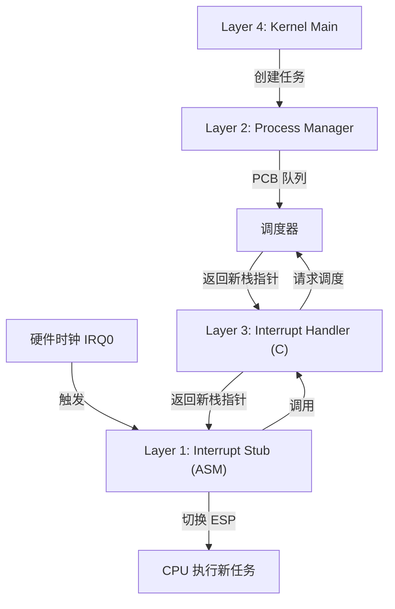
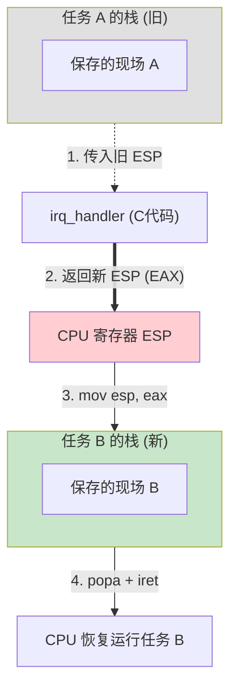

# Week 9 实战复盘：多任务系统的实现之路

> **摘要**：本文档记录了我们在 Week 9 中实现抢占式多任务系统的完整过程。这是一次跨越汇编层、中断层和内核层的深度改造。

## 1. 核心架构：三层模型

为了让操作系统支持多任务，我们必须打通从底层硬件到上层逻辑的通道：



## 2. 详细实现步骤

### Layer 1: 汇编层的魔法 (`isr.asm`)

这是最关键的一步。由于 C 语言无法直接修改 CPU 的栈指针（ESP），我们需要在汇编层动手脚。

**改动前**：中断处理完后，直接 `add esp, 4` 忽略 C 函数返回值，恢复旧栈。
**改动后**：读取 C 函数的返回值（存放在 `EAX`），并将其强制赋值给 `ESP`。

```diff
     push esp        ; 传递 struct registers* 参数
-    call irq_handler ; 调用C处理函数
-    add esp, 4      ; 清理参数
+    call irq_handler ; 调用C处理函数 (返回新的 ESP 到 EAX)
+    mov esp, eax    ; <---【关键】如果 EAX 变了，栈就切了！
```
这一行代码实现了“灵魂附体”：前一秒还在执行任务 A 的栈，下一秒 `popa` 时就已经是从任务 B 的栈里恢复寄存器了。

#### 图解：偷天换日 (Stack Pivot)



**原理解析**：
1.  **入栈**：中断发生时，CPU 自动把任务 A 的 `EIP` 等压入任务 A 的栈。
2.  **传参**：我们把指向任务 A 栈顶的指针 (`esp`) 传给 C 函数。
3.  **调度**：C 函数决定“不玩了，换人”，于是它不返回 A 的栈地址，而是返回了 B 的栈地址（存在 `EAX` 里）。
4.  **切换**：汇编指令 `mov esp, eax` 粗暴地把 CPU 的栈指针指向了 B 的栈。
5.  **出栈**：接下来的 `popa` 和 `iret` 并不是从 A 的栈里弹数据，而是从 B 的栈里弹数据。于是，CPU “以为”自己刚从任务 B 的中断里回来，顺理成章地跳到了任务 B 的代码继续执行。

### Layer 2: 进程管理核心 (`process.c`)

我们需要描述“即使暂停也能随时恢复”的任务。

1.  **PCB (Process Control Block)**：定义了任务的身份证。对于内核线程，最重要的是 `esp` 字段。
2.  **伪造现场 (`process_create`)**：
    *   当我们创建一个新任务时，它并没有真正运行过。
    *   我们必须手动在它的栈里填入全套寄存器值（Initial Stack Frame），假装它刚刚被中断过。这样当 `isr.asm` 执行 `iret` 时，就能“返回”到我们指定的函数入口。
3.  **轮转调度 (`schedule`)**：
    *   保存当前 `ESP` 到旧任务的 PCB。
    *   将 `Current` 指针移向链表下一个节点。
    *   返回新任务的 `ESP`。

### Layer 3: 中断层的桥梁 (`interrupts.c`)

我们将调度器挂载到了 **IRQ0 (系统时钟)** 上。

*   **修改函数签名**：`irq_handler` 从 `void` 变为返回 `struct registers*`。
*   **心跳检测**：每当收到 IRQ0 信号，就调用 `schedule(regs)`。
*   **非侵入式设计**：对于键盘等其他中断，直接返回原 `regs`，不发生调度。

```diff
- void irq_handler(struct registers* regs) {
+ struct registers* irq_handler(struct registers* regs) {
     if (regs->int_no >= 40) outb(0xA0, 0x20);
     outb(0x20, 0x20);
 
     // IRQ0: Timer
     if (regs->int_no == 32) {
         pit_ticks++;
-        return;
+        /* [关键] 调用调度器，返回新任务的栈指针 */
+        return schedule(regs);
     }
     
     // ... 其他中断处理 ...
+    return regs;
 }
```

### Layer 4: 顶层集成 (`kernel.c`)

最后，我们在 `kernel.c` 中像上帝一样创造生命：

1.  **初始化**：调用 `process_init()`，将当前正在运行的 `kmain` 注册为 **Idle 任务**（PID 0）。
2.  **创建任务**：生成 `task_a` 和 `task_b`。
3.  **开启时间**：执行 `sti` 开启中断，调度器开始工作。

## 3. 遇到的坑与教训

1.  **内核入口点漂移**：
    *   **现象**：启动黑屏，无 Welcome 信息。
    *   **原因**：在 `kernel.c` 头部定义了 `task_a` 函数。由于它位于文件最前，链接器将其放在了 `.text` 段的起始位置 `0x10000`。Bootloader 跳转后直接执行了 `task_a` 而非 `kmain`。
    *   **解决**：将所有子任务函数移至文件末尾，确保 `kmain` 始终位于二进制文件的最前端。

```diff
 /* kernel.c */

- void task_a(void) { ... }
- void task_b(void) { ... }
-
 void kmain(void) {
     /* 正确的入口点逻辑 */
     terminal_initialize();
     // ...
 }
 
+ /* 移到文件末尾，防止抢占入口点 */
+ void task_a(void) { ... }
+ void task_b(void) { ... }
```

2.  **返回值类型不匹配**：
    *   **现象**：编译报错 `return with no value`。
    *   **原因**：修改了 `irq_handler` 返回类型后，忘记更新键盘处理逻辑中的提前返回语句。
    *   **解决**：所有 `return;` 统一改为 `return regs;`。

## 4. 关键概念术语表 (Glossary)

*   **ESP (Extended Stack Pointer)**
    *   **形象比喻**：当前任务的“书签”。它指向栈的顶部。
    *   **作用**：决定了 CPU 当前使用的是哪块内存作为栈。**修改 ESP = 切换任务**。只要把 ESP 指向另一个任务的栈，CPU 继续执行 `pop` 指令时，恢复出来的就是另一个任务的寄存器值。

*   **EAX (Extended Accumulator Register)**
    *   **形象比喻**：通用的“搬运工”或函数的“回信信封”。
    *   **作用**：在 C 语言调用约定中，函数的**返回值**默认存放在 EAX 中。当我们写 `return new_stack_ptr;` 时，C 编译器其实是把 `new_stack_ptr` 的值放进了 EAX。所以我们在汇编里 `mov esp, eax` 实际上就是读取了 C 函数的返回值。

*   **IRET (Interrupt Return)**
    *   **形象比喻**：穿越回打断前的“传送门”。
    *   **作用**：这是一个原子操作，它一次性从栈中弹出 `EIP` (代码位置), `CS` (代码段), `EFLAGS` (标志位)。
    *   **魔法**：如果我们在 `iret` 执行前偷偷把栈换了（修改了 ESP），那么 `iret` 弹出的就是新任务的 `EIP`，于是 CPU 就“穿越”到了新任务的代码里继续执行。

## 5. 成果

屏幕上交替输出的 `ABABAB...` 证明了我们成功实现了**内核级抢占式多任务**。这是操作系统从“玩具”迈向“工具”的里程碑。
