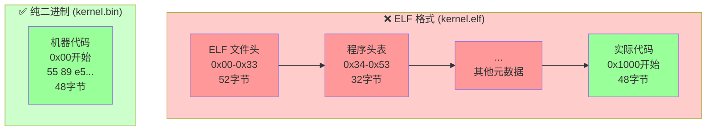

# 启动盘错误排查报告

**日期**: 2025-12-02  
**问题**: QEMU 启动时显示 "Disk error! Code: 0xJMx"  
**状态**: ✅ 已解决

---

## 问题现象

在 QEMU 中启动自制操作系统时，出现以下错误信息：

```
Booting from Hard Disk...
Starting...
LBA supported
Loading kernel...Disk error! Code: 0xJMx
```


---

## 排查过程

### 第一步：检查文件结构

检查生成的文件大小和格式：

```bash
$ ls -lh boot.bin kernel.bin os.img
-rw-r--r--  1 akm  staff   512B Dec  2 09:05 boot.bin
-rwxr-xr-x  1 akm  staff   4.4K Dec  2 09:05 kernel.bin
-rw-r--r--  1 akm  staff   4.9K Dec  2 09:05 os.img
```

### 第二步：分析 kernel.bin 格式

使用 `hexdump` 检查 `kernel.bin` 的内容：

```bash
$ hexdump -C kernel.bin | head -5
00000000  7f 45 4c 46 01 01 01 00  00 00 00 00 00 00 00 00  |.ELF............|
```

**发现问题 #1**: `kernel.bin` 是 **ELF 格式**文件（魔数 `7f 45 4c 46`），而不是纯二进制代码！

```bash
$ file kernel.bin
kernel.bin: ELF 32-bit LSB executable, Intel 80386, version 1 (SYSV), statically linked, not stripped
```

#### 问题分析

原构建脚本中的链接命令：
```bash
x86_64-elf-ld -m elf_i386 -T linker.ld -o kernel.bin kernel.o
```

这个命令生成的是 **ELF 可执行文件**，包含：
- ELF 文件头（52字节）
- 程序头表
- 节头表
- 符号表等元数据

而 bootloader 期望从 `0x10000` 地址加载的是**纯机器代码**，直接可执行。

#### ELF vs 纯二进制对比



**关键区别**：
- **ELF 格式**：实际代码在偏移 `0x1000` 处，前面是元数据
- **纯二进制**：从第一个字节就是可执行的机器代码
- Bootloader 加载到 `0x10000` 后直接跳转执行，如果是 ELF 格式会执行文件头数据！

#### 为什么会显示 "0xJMx"？

当 bootloader 跳转到 `0x10000` 时，实际执行的是 ELF 文件头数据：
```
7f 45 4c 46  →  这些字节被当作指令执行（随机指令！）
```

导致程序行为异常，错误代码寄存器 `ah` 被破坏，`print_hex` 函数打印出乱码。

### 第三步：检查镜像大小

即使修复了 ELF 问题，仍然报错。进一步检查：

```bash
$ ls -lh os.img
-rw-r--r--  1 akm  staff   560B Dec  2 09:09 os.img
```

**发现问题 #2**: `os.img` 只有 **560 字节**！

#### 问题分析

查看 [boot.asm](file:///Users/akm/CLionProjects/kernel_dev/boot.asm) 中的磁盘地址包（DAP）配置：

```asm
disk_address_packet:
    db 0x10        ; 数据包大小
    db 0           ; 保留
    dw 10          ; 要读取的扇区数 ← 10个扇区 = 5120字节
    dw 0x0000      ; 缓冲区偏移
    dw 0x1000      ; 缓冲区段地址
    dd 1           ; 起始LBA扇区号（扇区1）
    dd 0           ; 高32位
```

Bootloader 要求从 LBA 扇区 1 开始读取 **10 个扇区**（5120 字节），但：
- `os.img` 总大小只有 560 字节（约 1.1 个扇区）
- BIOS 试图读取不存在的扇区 2-10
- 返回磁盘读取错误

#### 问题镜像的扇区布局

```mermaid
block-beta
    columns 11
    block:sector0["扇区 0"]:1
        S0["boot.bin<br/>512字节<br/>✅ 存在"]
    end
    block:sector1["扇区 1"]:1
        S1["kernel.bin<br/>48字节<br/>✅ 存在"]
    end
    block:sector2["扇区 2"]:1
        S2["❌<br/>不存在"]
    end
    block:sector3["扇区 3"]:1
        S3["❌<br/>不存在"]
    end
    block:sector4["扇区 4"]:1
        S4["❌<br/>不存在"]
    end
    block:sector5["扇区 5"]:1
        S5["❌<br/>不存在"]
    end
    block:sector6["扇区 6"]:1
        S6["❌<br/>不存在"]
    end
    block:sector7["扇区 7"]:1
        S7["❌<br/>不存在"]
    end
    block:sector8["扇区 8"]:1
        S8["❌<br/>不存在"]
    end
    block:sector9["扇区 9"]:1
        S9["❌<br/>不存在"]
    end
    block:sector10["扇区 10"]:1
        S10["❌<br/>不存在"]
    end
    
    style S0 fill:#99ff99
    style S1 fill:#99ff99
    style S2 fill:#ff9999
    style S3 fill:#ff9999
    style S4 fill:#ff9999
    style S5 fill:#ff9999
    style S6 fill:#ff9999
    style S7 fill:#ff9999
    style S8 fill:#ff9999
    style S9 fill:#ff9999
    style S10 fill:#ff9999
```



**问题**：DAP 要求读取扇区 1-10（共10个扇区），但镜像只有 560 字节 ≈ 1.1 个扇区！

### 第四步：验证镜像内容

```bash
$ hexdump -C os.img | grep "00000200"
00000200  55 89 e5 83 ec 10 c7 45  fc 00 80 0b 00 8b 45 fc  |U......E......E.|\
```

内核代码确实在偏移 `0x200`（扇区 1）处，但后续扇区为空。

---

## 根本原因

### 问题 #1: ELF 格式问题

**原因**: 链接器生成的是 ELF 格式可执行文件，包含文件头和元数据  
**影响**: Bootloader 无法直接执行 ELF 头部数据，导致程序崩溃  
**位置**: [build.sh](file:///Users/akm/CLionProjects/kernel_dev/build.sh#L4)

### 问题 #2: 镜像大小不足

**原因**: 简单的 `cat` 拼接导致镜像文件过小，不足 10 个扇区  
**影响**: BIOS 读取超出文件范围的扇区时返回错误  
**位置**: [build.sh](file:///Users/akm/CLionProjects/kernel_dev/build.sh#L6)

---

## 解决方案

### 修复 #1: 提取纯二进制代码

使用 `objcopy` 工具从 ELF 文件中提取纯二进制代码：

```diff
- x86_64-elf-ld -m elf_i386 -T linker.ld -o kernel.bin kernel.o
+ x86_64-elf-ld -m elf_i386 -T linker.ld -o kernel.elf kernel.o
+ x86_64-elf-objcopy -O binary kernel.elf kernel.bin
```

**原理**: `objcopy -O binary` 只提取可加载段的原始数据，去除所有 ELF 元数据。

验证结果：
```bash
$ hexdump -C kernel.bin | head -3
00000000  55 89 e5 83 ec 10 c7 45  fc 00 80 0b 00 8b 45 fc  |U......E......E.|\
00000010  c6 00 48 8b 45 fc 83 c0  01 c6 00 0f 8b 45 fc 83  |..H.E........E..|\
00000020  c0 02 c6 00 69 8b 45 fc  83 c0 03 c6 00 0f eb fe  |....i.E.........|\
```

现在是纯机器代码，从 `55 89 e5`（`push ebp; mov ebp, esp`）开始。

### 修复 #2: 填充镜像到足够大小

使用 `dd` 命令创建固定大小的镜像：

```diff
  cat boot.bin kernel.bin > os.img
+ # 填充镜像到至少11个扇区（5632字节），确保有足够数据供bootloader读取
+ dd if=/dev/zero of=os.img bs=512 count=11 conv=notrunc 2>/dev/null
+ dd if=boot.bin of=os.img bs=512 count=1 conv=notrunc 2>/dev/null
+ dd if=kernel.bin of=os.img bs=512 seek=1 conv=notrunc 2>/dev/null
```

**步骤说明**:
1. 创建 11 个扇区（5632 字节）的空白镜像，填充为 0
2. 将 `boot.bin` 写入扇区 0（引导扇区）
3. 将 `kernel.bin` 从扇区 1 开始写入

#### 修复后的扇区布局

```mermaid
block-beta
    columns 11
    block:sector0["扇区 0<br/>0x0000"]:1
        S0["boot.bin<br/>512字节<br/>引导代码"]
    end
    block:sector1["扇区 1<br/>0x0200"]:1
        S1["kernel.bin<br/>48字节<br/>内核代码"]
    end
    block:sector2["扇区 2<br/>0x0400"]:1
        S2["填充<br/>0x00"]
    end
    block:sector3["扇区 3<br/>0x0600"]:1
        S3["填充<br/>0x00"]
    end
    block:sector4["扇区 4<br/>0x0800"]:1
        S4["填充<br/>0x00"]
    end
    block:sector5["扇区 5<br/>0x0A00"]:1
        S5["填充<br/>0x00"]
    end
    block:sector6["扇区 6<br/>0x0C00"]:1
        S6["填充<br/>0x00"]
    end
    block:sector7["扇区 7<br/>0x0E00"]:1
        S7["填充<br/>0x00"]
    end
    block:sector8["扇区 8<br/>0x1000"]:1
        S8["填充<br/>0x00"]
    end
    block:sector9["扇区 9<br/>0x1200"]:1
        S9["填充<br/>0x00"]
    end
    block:sector10["扇区 10<br/>0x1400"]:1
        S10["填充<br/>0x00"]
    end
    
    style S0 fill:#6699ff,color:#fff
    style S1 fill:#99ff99
    style S2 fill:#e0e0e0
    style S3 fill:#e0e0e0
    style S4 fill:#e0e0e0
    style S5 fill:#e0e0e0
    style S6 fill:#e0e0e0
    style S7 fill:#e0e0e0
    style S8 fill:#e0e0e0
    style S9 fill:#e0e0e0
    style S10 fill:#e0e0e0
```



**数据流程**：
1. BIOS 加载扇区 0 到内存 `0x7C00`，执行 bootloader
2. Bootloader 使用 LBA 读取扇区 1-10 到内存 `0x10000`
3. Bootloader 跳转到 `0x10000` 执行内核代码
4. 内核代码写入 VGA 显存 `0xB8000` 显示 "Hi"

验证结果：
```bash
$ ls -lh os.img
-rw-r--r--  1 akm  staff   5.5K Dec  2 09:11 os.img
```

现在镜像有 **5632 字节 = 11 个扇区**，足够 BIOS 读取！

---

## 修复后的构建流程

完整的 [build.sh](file:///Users/akm/CLionProjects/kernel_dev/build.sh)：

```bash
#!/bin/bash
# 1. 编译引导扇区
nasm -f bin boot.asm -o boot.bin

# 2. 编译内核源码
x86_64-elf-gcc -m32 -ffreestanding -nostdlib -c kernel.c -o kernel.o

# 3. 链接生成 ELF 格式
x86_64-elf-ld -m elf_i386 -T linker.ld -o kernel.elf kernel.o

# 4. 提取纯二进制代码
x86_64-elf-objcopy -O binary kernel.elf kernel.bin

# 5. 组装镜像（临时）
cat boot.bin kernel.bin > os.img

# 6. 填充镜像到11个扇区
dd if=/dev/zero of=os.img bs=512 count=11 conv=notrunc 2>/dev/null
dd if=boot.bin of=os.img bs=512 count=1 conv=notrunc 2>/dev/null
dd if=kernel.bin of=os.img bs=512 seek=1 conv=notrunc 2>/dev/null

# 7. 启动 QEMU
qemu-system-i386 -hda os.img
```

---

## 验证结果

运行修复后的构建脚本：

```bash
$ ./build.sh
WARNING: Image format was not specified for 'os.img' and probing guessed raw.
         Automatically detecting the format is dangerous for raw images, write operations on block 0 will be restricted.
         Specify the 'raw' format explicitly to remove the restrictions.
```

QEMU 成功启动，显示预期输出 "Hi"，不再出现磁盘错误！

---

## 经验总结

### 关键教训

1. **理解文件格式差异**
   - ELF 是**可执行文件格式**，包含元数据和多个段
   - Bootloader 需要的是**纯二进制代码**，直接映射到内存执行
   - 使用 `objcopy -O binary` 提取纯代码

2. **磁盘读取的扇区对齐**
   - BIOS 磁盘读取以**扇区**（512字节）为单位
   - 如果 DAP 要求读取 N 个扇区，镜像必须至少有 N 个扇区
   - 使用 `dd` 确保镜像大小正确

3. **调试技巧**
   - 使用 `hexdump` 检查二进制文件内容
   - 使用 `file` 命令识别文件格式
   - 检查文件大小是否符合预期

### 相关工具

| 工具 | 用途 |
|------|------|
| `objcopy -O binary` | 从 ELF 提取纯二进制代码 |
| `dd` | 创建固定大小的磁盘镜像 |
| `hexdump -C` | 以十六进制查看文件内容 |
| `file` | 识别文件格式 |

### 预防措施

1. **构建脚本中明确区分 ELF 和 binary**
   - 使用 `.elf` 扩展名表示 ELF 文件
   - 使用 `.bin` 扩展名表示纯二进制

2. **验证镜像大小**
   - 在构建脚本中添加 `ls -lh os.img` 验证
   - 确保大小 ≥ (bootloader 要求的扇区数 × 512)

3. **添加调试输出**
   - 在 bootloader 中打印更详细的错误信息
   - 显示实际读取的扇区数和返回的错误代码

---

## 参考资料

- [boot.asm](file:///Users/akm/CLionProjects/kernel_dev/boot.asm) - 引导扇区代码
- [kernel.c](file:///Users/akm/CLionProjects/kernel_dev/kernel.c) - 内核代码
- [linker.ld](file:///Users/akm/CLionProjects/kernel_dev/linker.ld) - 链接脚本
- [build.sh](file:///Users/akm/CLionProjects/kernel_dev/build.sh) - 构建脚本

---

**最后更新**: 2025-12-02  
**问题状态**: ✅ 已完全解决
