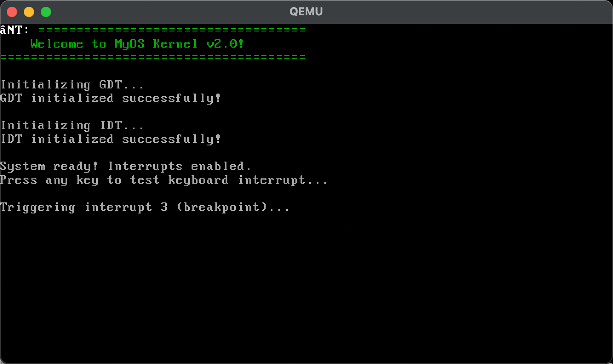

# kernel.c中asm volatile ("int $3");这行的含义
- 这行是 GCC 内联汇编，调用 x86 指令 `int $3`，触发软件中断向量 3（即“断点”中断）。位置：`/Users/akm/CLionProjects/kernel_dev/kernel.c:34`
- `volatile` 保证编译器不优化或重排该指令，确保中断被实际触发。

**执行路径**
- CPU 根据 IDT 查找向量 3 的门项，跳到 `isr3` 汇编入口：`/Users/akm/CLionProjects/kernel_dev/isr.asm:80–81`
- 汇编通用桩保存现场并调用 C 层处理函数：`/Users/akm/CLionProjects/kernel_dev/isr.asm:132–147`
- C 层在 `isr_handler` 中对 `int_no == 3` 特殊处理，输出 “Breakpoint (HALT)” 并停机（`hlt` 循环）：`/Users/akm/CLionProjects/kernel_dev/interrupts.c:32–44`

**相关初始化**
- 向量 3 的门项在 IDT 初始化时被注册：`/Users/akm/CLionProjects/kernel_dev/interrupts.c:89`
- 启用中断并触发断点用于验证 IDT/ISR/返回路径：`/Users/akm/CLionProjects/kernel_dev/kernel.c:29`, `kernel.c:33–34`

**补充**
- `int $3` 是 AT&T 语法，`$3` 表示立即数 3；这是经典的“断点”中断，常用于调试或验证中断机制。

- 不需要在 VSCode 里手动设置断点；`int $3` 本身就是触发“断点中断”（Trap 3）的软件指令，相当于主动命中一个断点。
- 你的内核用它来验证 IDT/ISR 链路是否工作，并在处理后用 `hlt` 停住，便于观察。

**两行代码的作用**
- `kernel.c:34` 的 `int $3`：向量 3 的软件中断，CPU 查 `IDT[3]` 跳到 `isr3`（`/Users/akm/CLionProjects/kernel_dev/isr.asm:80–81`），随后进入通用桩并调到 C 处理函数（`/Users/akm/CLionProjects/kernel_dev/isr.asm:132–147`）。
- `interrupts.c:41–43` 的 `while(1) hlt;`：在 `int 3` 分支里打印提示后让 CPU进入“停机”状态，直到下一个中断再唤醒，又立刻继续 `hlt`，形成稳定停机。这是为了调试“返回路径是否正确”（不走 `iret`，屏幕更稳定）。

**为什么不需要 VSCode 断点**
- 这是裸机内核，运行在 QEMU/真实机上；`int $3` 直接走硬件中断流程，比 IDE 断点更贴近真实机制。
- 你当前的 `isr_handler` 对 `int_no == 3` 有专门分支（`/Users/akm/CLionProjects/kernel_dev/interrupts.c:32–44`），因此能清晰看到“断点中断已触发”的视觉结果。

**如果你想做源级调试**
- 可用 QEMU 的 GDB stub 进行远程调试，然后用 GDB 或 VSCode C/C++ 插件连上 `:1234` 设置源级断点，例如在 `isr3` 或 `kmain`。这属于额外配置，和 `int $3` 的机制独立共存。

**结论**

- 截图里的界面是符合当前设计的。触发 `int 3` 后，异常处理会在屏幕左上角覆盖一段文本并进入停机循环，所以画面稳定不再滚动是预期行为。

**预期视觉效果**
- 顶行被覆盖为类似 “INT: 03 Breakpoint (HALT)” 的绿色提示（覆盖先前打印的欢迎横幅），来源：`/Users/akm/CLionProjects/kernel_dev/interrupts.c:32–44`。
- 其余内容保持为初始化日志（GDT/IDT 初始化、提示开启中断等），来源：`/Users/akm/CLionProjects/kernel_dev/kernel.c:20–34`。
- 之后画面不再更新，是因为异常路径进入 `while(1) hlt;`，位置：`/Users/akm/CLionProjects/kernel_dev/interrupts.c:41–43`。

**原因说明**
- 断点触发：`/Users/akm/CLionProjects/kernel_dev/kernel.c:34` 的 `int $3` 调用向量 3。
- IDT 跳转：CPU 查找 `IDT[3]` 并进入 `isr3`，位置：`/Users/akm/CLionProjects/kernel_dev/isr.asm:80–81`。
- C 层处理：打印断点提示后进入 `hlt` 死循环，不走 `iret` 返回，因此屏幕保持静止，便于定位返回路径问题，位置：`/Users/akm/CLionProjects/kernel_dev/interrupts.c:32–44`。

**提示**
- 如果你想继续观察键盘 IRQ 打印（`Received IRQ: 21`），需要避免进入断点的停机循环：暂时注释 `kernel.c` 的 `int $3`，或让 `isr_handler` 在 `int_no == 3` 分支里打印后返回而不是 `while(1) hlt;`。